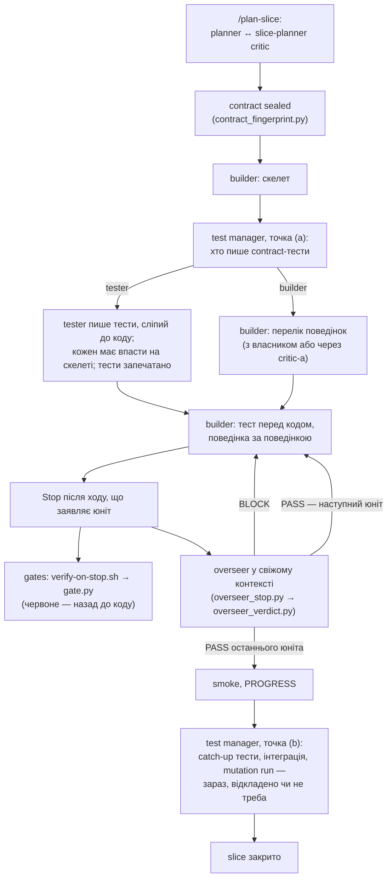
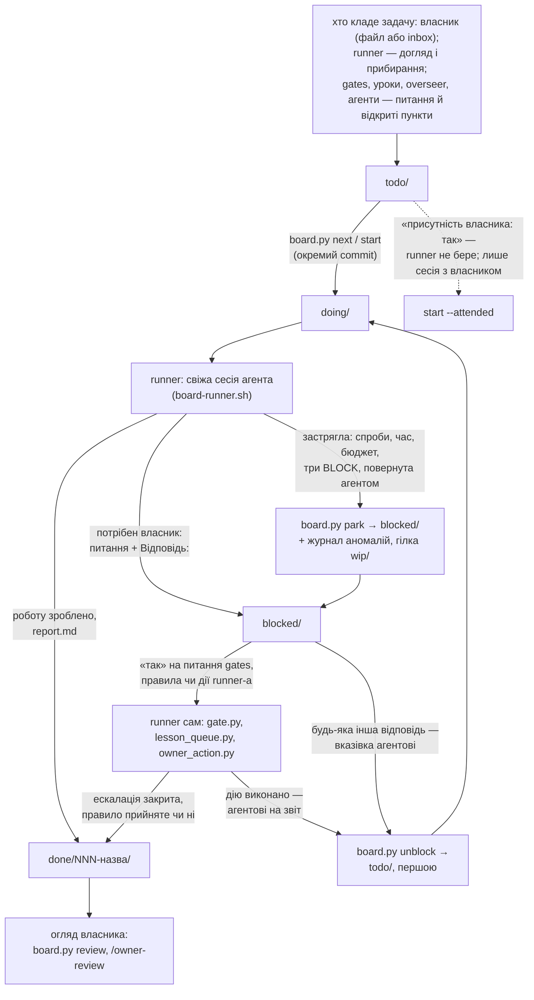
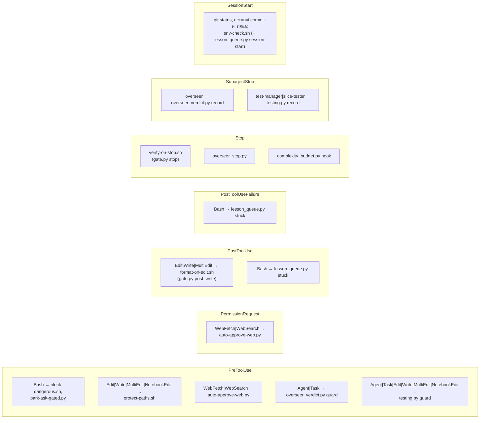

# Як влаштований двигун — architecture overview

Цей документ — карта: які частини є, як вони пов'язані і де читати докладно. Він нічого не
вирішує сам: правила — в `.claude/constitution.md` і `.claude/engine-rules.md`, механіка — у самих
файлах. Тест `tests/test_architecture_doc.py` тримає карту чесною: кожен шлях у зворотних лапках
існує, а діаграма hooks збігається з `.claude/settings.json` в обидва боки — подія, matcher і скрипт.

## Одним абзацом

Двигун — це набір ролей (агентів), які роблять роботу, і набір перевірок, які їм не вірять на
слово. Роботу приносить task board (`tasks/`): задачі кладе власник, а також сам двигун (питання
gates, пропозиції правил, відкриті пункти, догляд і прибирання). Runner
(`.claude/unattended/board-runner.sh`) бере задачу і запускає агента у свіжій сесії. Агент проєктує й
будує, hooks і gates перевіряють кожен хід, overseer у свіжому контексті приймає або відхиляє юніт,
а звіт і питання повертаються власникові через ту саму task board і огляд (`board.py review`,
команда /owner-review).

## Ролі

| Роль | Де визначена | Що робить |
|---|---|---|
| business analyst | `.claude/commands/business-analyst.md`, `.claude/agents/business-analyst.md` | команда: разом із власником пише цілі `.engine/goals.md`. Агент: на запит, який пишуть лише /master-architect і /feature-architect, або цитує рядок цілей, що вже вирішує питання, або ставить власникові питання з варіантами, порадою і готовим текстом поправки |
| master architect | `.claude/commands/master-architect.md` | будова всього проєкту: system design, software architecture, ADR; список функцій і їхній граф у .engine/architecture/INDEX.md проєкту, walking skeleton; кожну функцію веде через /feature-architect |
| feature architect | `.claude/commands/feature-architect.md` | одна функція від початку до кінця: розбиття на slice-и й contract-и між ними (`.engine/architecture/feature/<slug>.md`), tracer bullet, потім план і збірка кожного slice-а через /plan-slice → builder; закриття — `testing.py feature-close` |
| mvp architect | `.claude/commands/mvp-architect.md` | найдешевша система, що відповідає на одне питання |
| planner | `.claude/commands/plan-slice.md` | slice contract `.engine/slices/<slug>.md`, sealed після critic-а |
| critics | `.claude/agents/critic-core.md` (спільна основа master-, feature- і slice-planner-critic), `.claude/agents/master-critic.md`, `.claude/agents/feature-critic.md`, `.claude/agents/slice-planner-critic.md`, `.claude/agents/mvp-critic.md` | б'ють по проєкту до того, як він стане рамкою; mvp-critic — навпаки, шукає, що прибрати |
| builder | `.claude/skills/slice-builder/SKILL.md` | будує slice за TDD: скелет, перелік поведінок, тест перед кодом, smoke, PROGRESS |
| test manager | `.claude/agents/test-manager.md` | лише вирішує, нічого не пише й не тестує: у точці (a) — хто пише contract-тести, у точці (b) — catch-up тести, інтеграція, mutation run: зараз, відкладено чи не треба; `.claude/hooks/testing.py` не приймає рішення, що скасовує обов'язкове |
| tester | `.claude/agents/slice-tester.md` | пише contract-тести, сліпий до коду; розбирає заперечення builder-а до запечатаних тестів; пише інтеграційні тести |
| overseer | `.claude/agents/overseer.md`, `.claude/skills/overseer/SKILL.md` | audit одного юніта за 12 перевірками; вердикт пише скрипт, не агент |
| simplifier | `.claude/agents/simplifier.md`, `.claude/references/simplifier.md` | що можна прибрати; лише за сигналом; друга думка моделі іншого постачальника — коли її ввімкнено (`.claude/hooks/second_opinion.py`) |
| bugfix, hotfix | `.claude/commands/bugfix.md`, `.claude/commands/hotfix.md` | самі пишуть виправлення: повне з доказом (`bugfix.py prove`) або термінове в жорсткій межі з боргом у .engine/debt.md проєкту |
| onboard, maintain | `.claude/commands/onboard.md`, `.claude/commands/maintain.md` | знайомство з наявним проєктом; регулярний догляд |
| пам'ять, документація | `.claude/skills/self-learning-orchestrator/SKILL.md`, `.claude/skills/documentation/SKILL.md` | уроки й прибирання пам'яті; документація |
| огляд власника | `.claude/commands/owner-review.md` | проводить власника через огляд `board.py review` |

Усі critics і overseer — на найсильнішій моделі (`tests/test_model_roles.py`). Агенти спілкуються
файлами, а не чатом.

## Рівні проєктування

Чотири рівні: цілі (`.engine/goals.md`, рівень 0, змінюються лише відповіддю власника через
`.claude/hooks/goals.py`) → будова проєкту (master architect, ADR у теці docs/adr самого проєкту) →
функція (feature architect) → slice contract (planner). Кожне рішення архітектора має «Звірку з
цілями» — посилання на рядок рівня 0, яке перевіряє `goals.py check`. Код функції пише лише builder
(архітектори й planner коду не пишуть); виправлення пишуть /bugfix і /hotfix у своїх межах;
contract-тести може писати tester.

## Шлях одного slice

Gates і `.claude/hooks/overseer_stop.py` — два незалежні Stop hooks: overseer питають, коли хід заявляє юніт
(рядок `=== UNIT N COMPLETE ===`, команда перевірки і змінений код), а не коли gates зелені. Зв'язки між
ними два: поки ескалація gates відкрита, PASS не записується; без рішення test manager-а в точці (a)
audit не запитується. Вердикти overseer-а — PASS, BLOCK, ADR_REQUIRED, ESCALATE; три BLOCK поспіль на
один юніт відкладають задачу до власника. Slice без sealed contract-у (builder запущено напряму)
точок (a) і (b) не має. Перевірки: `.claude/references/gate.md` (gates),
`.claude/references/complexity-budget.md` (бюджет складності), `.claude/hooks/testing.py` (рішення
test manager-а).

## Шлях однієї задачі task board

Деталі: `tasks/README.md` (правила для власника й агента), `.claude/unattended/README.md`
(runner і його файли), `.claude/unattended/board.py` (єдиний читач task board),
`.claude/unattended/board_state.py` (що runner пам'ятає про задачу: спроби, витрати),
`.claude/unattended/board_review.py` (огляд), `.claude/unattended/owner_action.py` (короткий перелік
дій, які runner виконує на ваше «так»: застосувати пропозицію налаштувань — її перед тим судить
`.claude/unattended/settings_check.py`, — зробити урок правилом, внести поправку до цілей, оновити
залежності), `.claude/unattended/env-probe.sh` (яка це сесія: з наглядом, без нагляду, хмарна).
Commit — лише через `.claude/unattended/commit_checkpoint.sh`. Без задачі на task board агент без
нагляду не працює (`.claude/references/unattended.md`).

## Hooks і gates

Hooks прописані лише в `.claude/settings.json` проєкту; що робить кожен — `.claude/references/hooks.md`.
Matcher-и на діаграмі — дослівно з налаштувань.

Скільки разів Stop hooks можуть заблокувати кінець ходу, обмежує змінна
`CLAUDE_CODE_STOP_HOOK_BLOCK_CAP` у тих самих налаштуваннях (30).

- **Заборонні hooks** (`.claude/hooks/block-dangerous.sh`, `.claude/hooks/protect-paths.sh`, список
  шляхів — `.claude/hooks/protected-path-list.sh`) відмовляють тому, що заборонено за будь-яких умов:
  force push, push у `main` чи `stable`, видалення віддаленої гілки, переписування історії, секрети,
  очищення змінної `CLAUDECODE`, конституція, `.claude/settings.json`. `git commit` block-dangerous.sh
  пропускає лише на гілці `unattended/<date>` (і на власній гілці хмарної сесії) — через
  `.claude/unattended/commit_checkpoint.sh`. Дозволи — `.claude/references/permission-philosophy.md`.
- **park-ask-gated.py** — не заборона: без нагляду він перетворює команду, на яку треба дозвіл людини
  (push, публікація, залежності), на «відклади й іди далі»; з наглядом нічого не робить.
- **Gates** — один скрипт `.claude/hooks/gate.py` у чотирьох шарах; hooks — два з них: після кожного
  запису (`post_write`: форматування, швидкий lint, ніколи не блокує) і наприкінці ходу (`stop`: lint,
  type-check, тести проєкту з `.claude/project.env`, захист від обходу). Ще два — повний набір перед
  commit-ом і в CI (`pre_commit`, `ci`). Три червоні ходи поспіль (`GATE_MAX_BLOCKS`) — escalation і
  питання власникові в `tasks/blocked/9NN-gate-escalation-….md` (без task board — у
  `.engine/overseer/parked.md`).
- **Overseer**: `.claude/hooks/overseer_stop.py` робить запит на audit, коли хід заявляє юніт готовим;
  `.claude/hooks/overseer_verdict.py` пускає агента лише з рядком запиту і сам пише вердикт у
  `.engine/overseer/ledger.md`.
- **Бюджет складності**: `.claude/hooks/complexity_budget.py`; simplifier кличеться за сигналом
  (`.claude/hooks/simplify_signals.py`, `.claude/hooks/simplifier.py`).

## Пам'ять і уроки

Уроки ніколи не стають правилами самі. `.claude/hooks/lesson_queue.py` збирає кандидатів у
`.engine/lesson-queue.md` (зі звіту gates, BLOCK-ів overseer-а, відкладених пунктів і відкритих
пунктів task board, ескалацій; агент додає сам, коли знайшов неочевидну причину) і на початку кожної
сесії показує їх і каже, коли час прибирати пам'ять; пам'ять overseer-а — `.engine/overseer/MEMORY.md`.
Урок, схожий на правило, стає питанням `tasks/blocked/8NN-rule-proposal-….md`, і лише ваше «так»
дописує його в `.engine/rules.md`. Прибирання пам'яті — `.claude/skills/self-learning-orchestrator/SKILL.md`.

## Perimeter

Perimeter — те, що агент не може змінити сам навіть на прохання: конституція, `.claude/settings.json`,
затверджені правила, inbox оператора, `.git/`, міграції, CI. `.git/`, міграції й CI захищено двома
механізмами — `permissions.deny` у `.claude/settings.json` і заборонними hooks; конституцію,
налаштування, правила й inbox — заборонними hooks (`.claude/hooks/protected-path-list.sh`; для `.claude/` ще й
вбудований захист Claude Code). Hooks периметра й дозволи змінюються лише задачею «з присутнім
власником» (`tasks/README.md`); `.claude/settings.json` — одним шляхом: агент готує пропозицію
`docs/tasks/settings.json`, а на ваше «так» її застосовує runner (`owner_action.py apply-settings`).
Межі гарантій — `docs/engine-limits.md`.

## Встановлення й реліз

`engine.py` ставить і оновлює двигун у проєкті: що чиє — `.claude/ownership.txt` (engine, project,
machine, user), насіння проєкту — `templates/project/`. Реліз — лише командою власника
`engine.py release <version> --owner-approved` (`docs/release.md`). Сам реліз audit не запускає: він
перевіряє (`evals/needs_audit.py`), що останній повний audit покриває тексти, які йдуть у реліз, а
тоді — зелені тести, той самий golden set (`evals/run_hook_scenarios.py`), і лише тоді рухаються
`main`, `stable` і тег. Ваш прапорець `--without-audit` випускає й без audit-у і пише про це в журнал
аномалій. Як працювати над самим двигуном — `docs/working-on-the-engine.md`.
