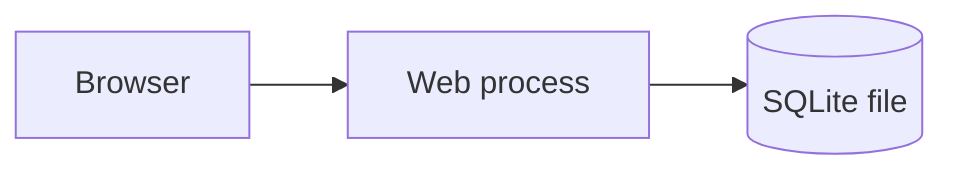

# Architecture map

## System design (M2)
One web process and one SQLite file on one server. The booking page and the day view are
server-rendered pages of the same process.

```mermaid
graph LR
  Browser --> Web[Web process]
  Web --> DB[(SQLite file)]
```
