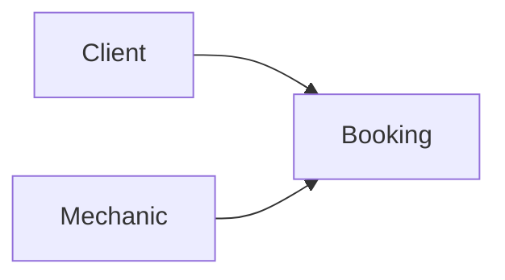

# Domain map

One bounded context: **Booking**. Terms: a *slot* is one hour of the mechanic's day; a
*booking* is a client's name and phone attached to a slot; the *day view* is the mechanic's
list of bookings for one date.

