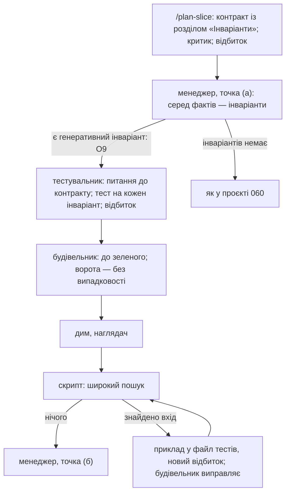

# 048 — Тести властивостей та інваріанти в контракті зрізу: проєкт рішення

Це проєкт рішення, а не збудована річ: жодного файла двигуна не змінено, платних прогонів не було.
Задача чекає ваших відповідей у `tasks/blocked/048-property-tests-design.md` — п'ять питань.
Проєкт спирається на остаточну редакцію проєкту 060 (`tasks/done/060-tester-design/report.md`) і
на результат досліду 061; де я посилаюся на «розділ N проєкту 060» — це той файл.

## Що змінилось для власника
- **У коді нічого.** Є проєкт і п'ять питань до вас. Будівництва на дошці ще немає: воно залежить
  від ваших відповідей і від задачі 062 (ролі тестувальника й менеджера, скрипт `testing.py`).
- **Що пропоную, одним абзацом.** У контракті зрізу з'являється розділ «Інваріанти»: правила, що
  мають триматися на *будь-якому* вході із названої області, а не на трьох прикладах. Пише їх
  планувальник зрізу (критик уже сьогодні вимагає від нього принаймні один такий на шов — просто
  зараз це ніде не лишається окремим рядком). Тест на кожен інваріант пише той, хто пише
  контрактні тести зрізу; я раджу, щоб для таких зрізів це завжди був незалежний тестувальник.
  Бібліотеку (Hypothesis чи іншу) двигун не встановлює — як і з мутаційним інструментом.
- **Найважливіше технічне рішення.** Випадково згенеровані входи не можна пускати у ворота
  наприкінці ходу: ворота, що сьогодні зелені, а завтра червоні на тому самому коді, — не ворота
  (принцип P1). Тому у воротах такі тести йдуть *без випадковості* (той самий набір входів щоразу),
  а широкий випадковий пошук скрипт запускає окремо, коли зріз завершено. Знайдений ним вхід
  стає звичайним тестом-прикладом назавжди.
- **Що я перевірив безплатно, а що ні.** Перевірив, що механіка працює саме так, як проєкт на неї
  розраховує (розділ 7). Не перевіряв головного: чи дає це на справжніх контрактах більше, ніж
  уважний тестувальник із прикладами. Дослід 061 навчив не вірити такому наперед, тож я раджу
  спершу платний дослід на три плеча (питання 4) — і будувати лише після нього.

## Проєкт рішення

### 1. Що таке тест властивості і де він щось дає

Звичайний тест каже: «для входу 100 і 4 відповідь — чотири рази по 25». Тест властивості каже:
«для будь-якої суми і будь-якої кількості людей частини в сумі дають усю суму», — а бібліотека
сама добирає сотні входів і, коли правило ламається, зменшує вхід до найпростішого, на якому
воно ламається. Його сила не в тому, хто пише тест, а в тому, що входи добирає не людина й не
модель: помилка на вході, про який ніхто не подумав, знаходиться без того, щоб про нього подумати.

Де це доречно — п'ять форм правил, і лише вони:

| Форма | Приклад | Типова помилка, яку ловить |
|---|---|---|
| **туди й назад** | розібрати те, що сам надрукував, — вийде те саме | ціна від 1000 з роздільником розрядів; порожній рядок |
| **збереження** | частини рахунку в сумі дають рахунок; після переказу сума на двох рахунках та сама | загублений залишок від ділення |
| **повтор нічого не змінює** | нормалізувати двічі — те саме, що раз | пробіли різних видів, регістр, уже нормалізоване |
| **межа, яку не можна перейти** | залишок на складі ніколи не від'ємний; знижка ніколи не більша за ціну | рідкісне поєднання двох законних входів |
| **звірка з еталоном** | нова швидка функція дає те саме, що стара повільна | переписування без зміни поведінки (рефакторинг) |

Де це не доречно: тонка обгортка над чужим API, з'єднання, налаштування, перенесення, поведінка,
яку контракт задає переліком випадків. Там інваріантів немає, і вигадувати їх — це вигадувати
вимоги. «Не падає на жодному вході» інваріантом не вважаю: це перевірка без правила.

### 2. Місце в контракті: розділ «Інваріанти»

Новий розділ у шаблоні контракту зрізу (`/plan-slice`, `.claude/templates/slice-contract.md`),
між «Hardest seams» і «Exit criterion». Розділ є в кожному новому контракті; «немає — причина» —
повноправна відповідь, і для обгорток вона правильна.

```markdown
## Invariants (rules that hold for every input in the stated domain)
- **I1** — частини в сумі дорівнюють рахунку.
  - Область: сума в центах від 0; людей від 1.
  - Джерело: критерій приймання функції, рядок 3.
  - Порушить: реалізація, що ділить націло і губить залишок.
  - Перевірка: генеративна.
- **I2** — після будь-якої послідовності резервувань залишок не від'ємний.
  - Область: … Джерело: … Порушить: …
  - Перевірка: прикладами — кожен крок іде в справжню базу, сотня входів триватиме хвилини.
```

П'ять полів, і кожне має свою причину:
- **Правило** — одним реченням, мовою задачі, не коду.
- **Область** — для яких саме входів. Це найважливіше поле: саме тут автор коду несвідомо
  звужує «будь-який вхід» до «входів, які мій код уміє». Записана в запечатаному контракті,
  область не належить ні будівельникові, ні тестувальникові.
- **Джерело** — рядок документа цілей, артефакту функції, рішення власника або розділу «Seam»
  цього ж контракту, з якого правило випливає. Інваріант без джерела — вигадана вимога (стаття 4
  конституції), критик його відхиляє. Якщо в правилі є число чи поріг — це ваше рішення, і воно
  йде через наявну ратифікацію порогів у `/plan-slice` (стаття 5); нового шляху не треба.
- **Порушить** — хибна реалізація, яку правило впіймало б. Це вже вимагає критик («Falsification»);
  інваріант, для якого такої не назвати, нічого не перевіряє.
- **Перевірка** — `генеративна` або `прикладами` з причиною. Генеративна — лише коли одна
  перевірка не потребує зовнішньої системи (чиста логіка або стан у пам'яті). Інакше — один
  гострий тест-приклад на вхід із поля «Порушить», як сьогодні.

Контракти, запечатані раніше, розділу не мають; для скрипта це факт «інваріантів не названо», а
не помилка. Відбитки старих контрактів не змінюються.

### 3. Хто що робить

| Хто | Що | Чого не робить |
|---|---|---|
| **Планувальник зрізу** (`/plan-slice`, фаза 3) | пише розділ «Інваріанти» | не пише тестів |
| **Критик планувальника** | перевіряє кожен інваріант: є джерело; є «порушить»; область не вужча за ту, що випливає із «Seam»; правило не переказує реалізацію («результат дорівнює формулі з коду»); для шва зі станом, розбором, серіалізацією чи порядком розділ не порожній без причини | не додає інваріантів сам — лише вимагає |
| **Ви** | ратифікуєте лише інваріант із числом чи порогом — тим шляхом, що вже є | про решту вас не питають |
| **Той, хто пише контрактні тести зрізу** (за рішенням менеджера: тестувальник або будівельник) | один тест на кожен інваріант, з його номером у назві (`test_I1_…`); область генератора — рівно поле «Область» | не звужує область, не вимикає перевірок здоров'я бібліотеки |
| **Тестувальник** | інваріант, якого, на його думку, бракує, або область, яку можна прочитати двояко, — здає як **питання до контракту** (це його головний вихід за дослідом 061) | не дописує інваріантів у запечатаний контракт |
| **Скрипт `testing.py`** | перевіряє, що на кожен генеративний інваріант є тест із його номером; запускає широкий пошук; записує знайдене | не судить, чи інваріант добрий |
| **Менеджер тестування** | отримує інваріанти як факти (скільки, які генеративні); судить решту, як у проєкті 060 | не скасовує обов'язкових випадків |
| **Наглядач** (перевірка №4) | область у тесті збігається з областю в контракті; перевірки здоров'я не приглушено; тест не повторює реалізацію | — |

**Чому раджу завжди кликати тестувальника, коли є генеративний інваріант (новий обов'язковий
випадок О9, питання 2).** Автор, що пише і код, і генератор входів, має найдешевший вихід із
червоного тесту: звузити генератор («людей від 2», «сума кратна кількості»). Це той самий хід,
що й послабити тест, тільки непомітніший: тест лишається, назва та сама, правило те саме.
Тестувальник пише генератор з контракту до появи коду, і файл запечатується відбитком.
Якщо ви вирішите лишити це на судження менеджера — проєкт працює так само, просто цей вихід
стереже лише наглядач.

Правило досліду 061 «один тест на поведінку» лишається: інваріант — одна поведінка, один тест.
Заборона «вичерпних наборів тестів властивостей» на рівні зрізу (`slice-builder`, правило 6;
критик, фаза 3) теж лишається — змінюється лише одне речення: тест властивості дозволено рівно
там, де контракт називає генеративний інваріант, і ніде більше.

### 4. Як і коли це запускається

Два налаштування в `.claude/project.env`, обидва типово порожні; двигун нічого не встановлює
(додати пакет — дія власника проєкту, як і з `MUTATION_CMD`):

| Ключ | Що означає | Якщо порожній |
|---|---|---|
| `PROPERTY_LIB` | назва бібліотеки, якою в проєкті пишуть тести властивостей (`hypothesis`, `fast-check`…) | кожен інваріант перевіряється гострим прикладом; в огляді рядок «інваріант без генеративної перевірки: бібліотеку не задано» |
| `PROPERTY_SEARCH_CMD` | команда широкого пошуку: ті самі тести, але з випадковими входами і межею часу, яку задає проєкт | широкого пошуку немає; тести йдуть лише у звичайному наборі |

Три моменти запуску:

1. **У звичайному наборі тестів, на кожних воротах — без випадковості.** Тест властивості
   лежить у файлі контрактних тестів і запускається тією самою `TEST_CMD`. Режим — детермінований
   (у Hypothesis це `derandomize=True`): ті самі входи щоразу, той самий результат щоразу. Ворота
   лишаються воротами. Кількість входів — типова для бібліотеки; свого числа двигун не вводить
   (принцип P6).
2. **Широкий пошук — коли зріз завершено, точка (б), і запускає його скрипт.** Якщо в контракті є
   генеративні інваріанти і задано `PROPERTY_SEARCH_CMD`, `testing.py request` перед запитом до
   менеджера сам запускає пошук і кладе результат у факти: тривалість, знайдено чи ні. Це
   машинний час без жодного проходу агента, доки нічого не знайдено, — тому раджу робити це на
   кожному такому зрізі, а не рідко, як мутаційний прогін (питання 3).
3. **Знайдений вхід — знахідка, а не суперечка.** Бібліотека друкує найменший вхід, на якому
   правило ламається. Скрипт записує його в журнал тестування; тестувальник дописує його у файл
   тестів як звичайний приклад (у Hypothesis — рядок `@example(…)`), файл отримує новий відбиток;
   будівельник виправляє код. Далі цей вхід перевіряється на кожних воротах, уже без жодної
   випадковості. Якщо будівельник вважає, що хибний не код, а правило чи область, — це звичайне
   коло суперечки з проєкту 060 (розділ 5), і воно може скінчитися «контракт двозначний».

Службову теку бібліотеки (`.hypothesis/`) у git не кладемо: усе, що має пережити прогін, — це
приклади, дописані у файл тестів.

**Доказ, що тест уміє падати.** Проти каркаса без тіл тест властивості падає, як і будь-який
інший, — прогін RED скрипта працює без змін. Специфічна хвороба таких тестів — порожня
перевірка: генератор відсіює майже все, і правило «тримається» на жодному вході. Бібліотека
сама це ловить перевіркою здоров'я (перевірено, розділ 7); тому приглушувати перевірки здоров'я
заборонено у визначенні тестувальника, а `testing.py record` відхиляє здачу, де їх приглушено.
Для Hypothesis це пошук одного слова у файлі; для інших бібліотек — правило у визначенні й
перевірка №4 наглядача, і це чесно записується в `docs/engine-limits.md`.

**Обов'язковий випадок точки (б), який додається в кожному разі:** широкий пошук знайшов вхід —
виправлення йде зараз, відкласти його менеджер не може (за змістом це О6: відома помилка).

### 5. Як це вписується в цикл зрізу проєкту 060

Нових ролей, нових точок рішення і нових рядків у `settings.json` немає. Змінюється чотири місця:



Інваріанти, що охоплюють кілька зрізів («після будь-якої послідовності операцій склад не
від'ємний»), найцінніші й найдорожчі: їх перевіряють послідовностями операцій, а писати такі
тести помітно важче. Їхнє місце — артефакт функції і режим «блок» тестувальника при закритті
блока. У перше будівництво я їх **не** включаю (принцип P7) і питаю вас про це (питання 5).

### 6. Що це дає і скільки коштує

**Дає (очікування, не вимір):**
- помилки на входах, яких ніхто не перелічив: межі, порожнє, дублікати, залишки від ділення,
  рідкісні поєднання двох законних входів;
- правило записане один раз і в запечатаному місці — його бачать планувальник, критик,
  тестувальник, будівельник і наглядач, і ніхто з них не може тихо його звузити;
- знайдений вхід — найменший із можливих, тож виправлення починається не з пошуку причини;
- для переписування без зміни поведінки — звірка з еталоном замість переліку прикладів.

**Чого не дає:** правила, якого ніхто не записав, тест не перевірить; на тонких обгортках і
з'єднаннях нічого; і немає жодного виміру, що модель, яка пише тести-приклади з уважно
прочитаного контракту, цих самих входів не вгадає сама. Дослід 061 саме таке очікування й
спростував для «сліпоти до коду».

**Коштує:**

| Що | Скільки | Звідки число |
|---|---|---|
| Планувальник: розділ «Інваріанти» | кілька рядків; інваріант на шов критик вимагає вже сьогодні | оцінка |
| Тестувальник: тест властивості замість або понад приклад | оцінка: до половини проходу зверху на зрізі з інваріантами ($0.5–1.5 за прохід — оцінка проєкту 060) | не виміряно; дасть дослід |
| Ворота: детермінований прогін | частки секунди на чистій логіці: сто входів за 0,44 с разом із запуском pytest | виміряно, розділ 7 |
| Широкий пошук | машинний час у межі, яку задає команда проєкту; агентів не кличе | — |
| Знайдений вхід | одне коло будівельника і короткий прохід тестувальника | як знахідка інтеграційного тесту в 060 |
| Бібліотека | залежність у проєкті — ставить власник проєкту; у самому двигуні залежностей немає, і тут ключі лишаються порожні | — |
| Тривалість зрізу | без нових проходів агентів, доки пошук нічого не знайшов | — |

### 7. Що я перевірив зараз, безплатно

Малий дослід у тимчасовій теці (нічого в репозиторії не лишилось; бібліотеку взято через `uvx`,
як pytest у досліді 061, — у проєкт нічого не встановлено). Функція ділить рахунок і губить
залишок. Hypothesis 6.168.5.

| Перевірка | Результат |
|---|---|
| три звичайні приклади (100 на 4, 90 на 3, 77 на 1) | **3 пройшло** — помилки не видно |
| тест властивості «частини в сумі дають рахунок» | **упав**, найменший вхід: сума 1, людей 2; 0,44 с |
| той самий тест у детермінованому режимі, двічі | вивід **тотожний** — у воротах він не блиматиме |
| генератор, що відсіює майже всі входи | бібліотека **сама впала** з «відсіяно 50 із 50» — порожня перевірка не проходить мовчки |
| після виправлення | 4 пройшло, 0,47 с |

Це показує, що механіка, на яку спирається розділ 4, справжня. Користі це **не** показує: я сам
написав і помилку, і три приклади, які її не бачать.

### 8. На яких сценах перевірити користь — дослід до будівництва

Той самий інструмент, що в 061 (`evals/run_tester_evals.py`: сцена, пісочниця, рахує скрипт —
«впіймано» означає, що набір тестів агента падає на хибній реалізації і проходить на правильній).
Відмінність від 061 — у пастках: там пастка була рядком контракту, і її знаходив кожен, хто
читав. Тут пастка — **вхід, якого контракт не перелічує**, хоча правило його охоплює.

Три плеча, щоб розділити дві речі, які легко сплутати, — «правило записали» і «входи добирає
машина»:

| Плече | Контракт | Чим пише тести |
|---|---|---|
| А | без розділу «Інваріанти» (як сьогодні) | приклади |
| Б | з розділом «Інваріанти» | приклади — бібліотеки немає |
| В | з розділом «Інваріанти» | бібліотека тестів властивостей |

Якщо Б ловить стільки ж, скільки В, — користь дає сам розділ у контракті, а бібліотека зайва, і
будувати треба лише розділ (це дешева половина). Якщо А ловить стільки ж, скільки В, — не
будувати нічого з цього, і це теж результат.

П'ять сцен на еталонному проєкті, по одній на форму з розділу 1 і одна контрольна:

| Сцена | Правило | Хибна реалізація ламається лише на |
|---|---|---|
| `roundtrip` | надрукована ціна розбирається назад у ту саму | цінах від 1000 і на цілих без копійок |
| `conserve` | частини рахунку в сумі дають рахунок | сумах, що не діляться націло |
| `idempotent` | нормалізувати артикул двічі — те саме, що раз | рядках із двома видами пробілів поспіль |
| `bound` | після резервування й скасування залишок не від'ємний | скасуванні більшого, ніж зарезервовано, одразу після нульового резерву |
| `none` (контрольна) | тонка обгортка: інваріантів немає | — тут міряється інше: чи планувальник і тестувальник *не вигадають* інваріант і чи не впаде їхній набір на правильній реалізації |

Що записати, крім «впіймано»: скільки тестів і скільки коштує кожне плече; чи падає набір на
правильній реалізації (суворіше прочитання — хвороба, яку знайшов 061); у плечі В — чи область
генератора збігається з областю в контракті. Хибні реалізації й правильні я напишу до прогонів і
після результату не чіпатиму; кожна хибна має проходити «очевидні» приклади з контракту — це
перевіряє безплатний тест інструмента.

Оцінка: 5 сцен × 3 плеча = 15 коротких сесій; у 061 сесія коштувала $0.10–0.16, тут плече В
дорожче — разом $2–4. Прошу ліміт $10 як запобіжник (питання 4).

**У живій роботі, після будівництва (безплатно, у вашому огляді):** скільки входів знайшов
широкий пошук на коді, який уже пройшов усі приклади й наглядача, — це пряма міра користі;
скільки інваріантів записано і скільки з них «прикладами» та чому; скільки зрізів мали «немає —
причина»; скільки питань до контракту стосувалися інваріантів; тривалість пошуку. Усе це —
рядки розділу «Тестування» огляду і матеріал для розбору після десяти зрізів, який уже
передбачено проєктом 060. Показники для читання, не цілі для агента (стаття 3).

### 9. Що довелося б змінити (для задачі будівництва, після 062)

| Файл | Зміна |
|---|---|
| `.claude/templates/slice-contract.md`, `.claude/commands/plan-slice.md` | розділ «Invariants» з п'ятьма полями; «немає — причина» дозволено |
| `.claude/agents/slice-planner-critic.md` | техніка «Property / invariant» фази 3 пише в цей розділ; перевірки з розділу 3; речення про заборону уточнено |
| `.claude/agents/slice-tester.md` (з 062) | тест на кожен генеративний інваріант, номер у назві, область рівно з контракту, без приглушення перевірок здоров'я; бракує інваріанта — питання до контракту |
| `.claude/skills/slice-builder/SKILL.md` | правило 6: тест властивості — лише на інваріант із контракту; знайдений вхід — пакет, як упалий інтеграційний тест |
| `.claude/hooks/testing.py` (з 062) | інваріанти як факти; О9, якщо ви погодитесь; у `record` — на кожен генеративний інваріант є тест із номером, перевірки здоров'я не приглушено; у точці (б) — широкий пошук і запис знайденого |
| `.claude/agents/test-manager.md` (з 062), `.claude/agents/overseer.md` | факти про інваріанти; три пункти до перевірки №4 |
| `.claude/unattended/board_review.py` | рядки в розділі «Тестування» |
| `.claude/project.env`, `templates/project/.claude/project.env` | `PROPERTY_LIB`, `PROPERTY_SEARCH_CMD`, типово порожні |
| `docs/engine-limits.md`, `.claude/references/` | межа: приглушення перевірок здоров'я скрипт бачить лише для названих бібліотек |
| `tests/`, `evals/` | кожна нова відмова скрипта — з показаним негативним випадком; сцени розділу 8 |

Конституція і `settings.json` не змінюються.

## Що я розглянув і відкинув
- **Інваріанти пише тестувальник, а не планувальник.** Тоді правило з'являлося б після
  запечатання контракту і не проходило б ні критика, ні, де є поріг, вашу ратифікацію.
  Тестувальник лишає за собою краще: питання «тут бракує правила».
- **Інваріанти всередині «Hardest seams» або «Exit criterion», без свого розділу.** Так є
  сьогодні, і саме тому їх не може прочитати скрипт: ні порахувати, ні перевірити, що на кожен є тест.
- **Обов'язковий інваріант у кожному контракті.** Породжує вигадані правила для обгорток; це
  число-ціль у чистому вигляді (стаття 3).
- **Випадкові входи просто у воротах.** Ворота, що блимають, вчать агента перезапускати їх, а не
  читати помилку. Суперечить P1.
- **Свій малий генератор входів на стандартній бібліотеці,** щоб нічого не ставити. Це писати
  Hypothesis удруге, без зменшення входу до найпростішого — а воно і є половиною користі (P7).
- **Двигун сам додає Hypothesis у проєкт.** Додавання пакетів — дія власника; і не всі проєкти на Python.
- **Число входів і межа часу як налаштування двигуна.** Число стало б ціллю і предметом
  торгу; типове число бібліотеки і команда проєкту — досить (P6).
- **Широкий пошук лише при закритті великого блока, як мутаційний.** Мутаційний дорогий, бо
  довгий і його результат розбирає агент; пошук короткий, і агент потрібен лише коли щось знайдено.
- **Тести властивостей на код самого двигуна.** У двигуні немає залежностей і немає pytest;
  заради цього їх не заводжу. Розбирачі двигуна (дошка, відбитки) — добрі кандидати, якщо ви
  колись вирішите інакше; це окрема задача.
- **Будувати без досліду.** 061 уже раз показав, що правдоподібне очікування не справдилось.

## Демонстрація на хвилину
Показувати нічого: це проєкт. Щоб оцінити його за хвилину — зразок розділу контракту (розділ 2),
таблиця «хто що робить» (розділ 3) і таблиця безплатної перевірки (розділ 7).

## Витрати
Одна сесія агента, без підагентів, без платних прогонів, без аудиту (`Аудит потрібен: ні`).
Змінено лише файли дошки (жодного `.py` чи `.sh`), тому повний набір тестів не запускався.

## Діапазон commit-ів
`138874d` (задача в роботі) … commit «board: 048-property-tests-design → blocked».

## Відкладене
- Дослід на три плеча — після вашої відповіді на питання 4, окремою задачею.
- Будівництво — окремою задачею після досліду і після 062.
- Інваріанти на рівні функції (послідовності операцій) — питання 5.
- Тести властивостей для коду самого двигуна — не пропоную; див. «відкинув».

## Рішення, які я ухвалив сам
- **Звіт і задачу поклав у `blocked/`,** як велить сама задача і як було з 060; у `done/` вони
  перейдуть після ваших відповідей.
- **Два ключі налаштувань замість одного:** назва бібліотеки потрібна тестувальникові, навіть
  коли широкого пошуку немає. Обидва типово порожні, двигун нічого не встановлює — за зразком
  вашої відповіді 4 у задачі 060 про мутаційний інструмент.
- **У воротах — лише детермінований режим;** знайдений вхід стає звичайним прикладом у
  запечатаному файлі. Це технічний наслідок P1, окремо не питаю.
- **П'ять полів інваріанта,** серед них обов'язкові «Джерело» і «Порушить».
- **«Не падає на жодному вході» інваріантом не вважаю.**
- **Генеративна перевірка лише там, де їй не потрібна зовнішня система;** інакше гострий приклад.
- **Знайдений пошуком вхід не можна відкласти** — прочитав це як наявний О6, не як нове правило.
- **Безплатний малий дослід через `uvx`** (розділ 7): у репозиторій і в проєкт нічого не
  встановлено, платних сесій не було.
- **Задачі досліду й будівництва на дошку не клав:** обидві залежать від ваших відповідей.
