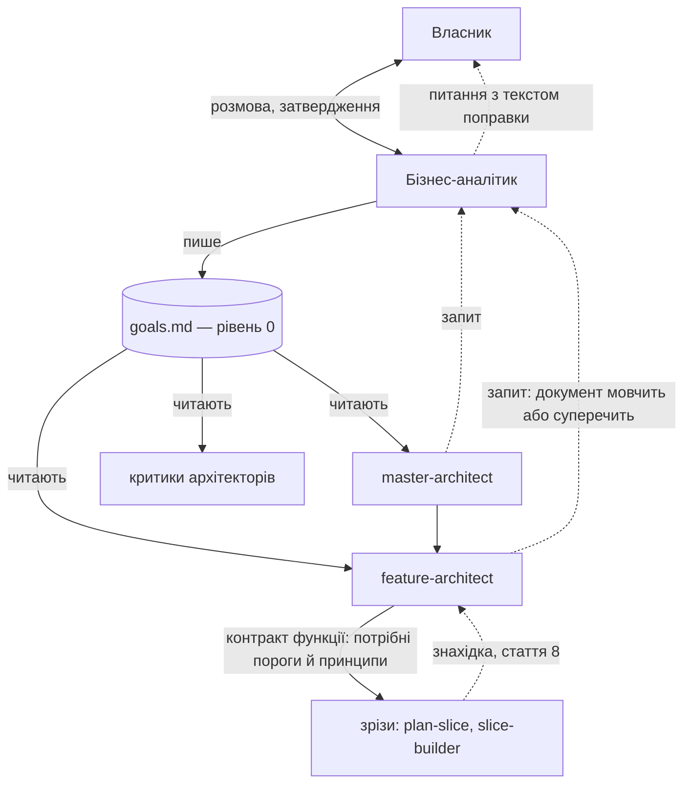

# 050 — Бізнес-аналітик і документ цілей: проєкт рішення (чернетка звіту)

Це проєкт рішення, а не збудована річ: жодного файла двигуна не змінено, платних прогонів не
було. Задача чекає в `blocked/` на вісім відповідей власника (`050-business-analyst-design.md`
поруч). Будувати — окремою задачею після відповідей.

## Що змінилось для власника
- **У коді нічого.** Є проєкт рішення і вісім питань.
- **Суть.** Над архітектурою з'являється рівень 0 — один документ цілей проєкту
  (`.engine/goals.md`, одна сторінка), який ви складаєте разом із бізнес-аналітиком і
  затверджуєте. Кожне рішення архітектора після цього посилається на рядок цього документа, а
  сліпий критик перевіряє, чи посилання чесне.
- **Що це дає вам.** Сьогодні про мету проєкту двигун питає один раз, одним рядком («Product
  vision & constraints», `.claude/commands/master-architect.md:81`), і ніде окремо її не
  зберігає. Тож кожна функція заново питає вас про продуктові речі, а архітектор, обираючи між
  двома варіантами, не має письмового «що для нас важливіше». Документ цілей — це ваша
  відповідь, дана один раз і записана так, щоб на неї можна було послатися.
- **Бізнес-аналітик не вирішує нічого.** Він розпитує, загострює, знаходить суперечності й
  записує. Цілі, принципи й критерії «готово» — продуктові рішення, вони ваші (стаття 5
  конституції). Конституція не змінюється.
- **`settings.json` не змінюється**, нових hook-ів немає.

## Проєкт рішення

### 1. Роль, вхід і вихід

Бізнес-аналітик існує у двох формах з одного визначення.

| Форма | Коли | З ким говорить | Що видає |
|---|---|---|---|
| Команда `/business-analyst` | на початку проєкту, перед `/master-architect`; і коли ви самі хочете змінити цілі | з вами, наживо | `.engine/goals.md`, який ви затвердили |
| Агент `business-analyst` у свіжому контексті | після початкового планування, лише на запит архітектора (розділ 3) | з архітектором — через файл запиту | або посилання на рядок документа, що вже відповідає; або сформульоване питання до вас із готовим текстом поправки |

**Вхід початкової розмови:** ваші слова, матеріали, які ви дасте (опис, листування, наявний
код), і для наявного проєкту — те, що вже записано в `.engine/architecture/` і `docs/adr/`.

**Як він веде розмову.** По одному питанню за раз, як M1 в архітектора. Чотири прийоми, заради
яких роль і існує:
1. *Ціль має бути спостережуваною.* «Зручний сервіс» не приймається; він питає «що ви побачите,
   коли це вдалося» і записує саме це.
2. *Принцип — це вибір між двома добрими речами.* «Ми цінуємо якість» відхиляється: ніхто не
   цінує протилежне. Приймається «швидкість виходу понад повноту функцій» — і до кожного
   принципу один приклад рішення, яке він розв'язує.
3. *Не-цілі обов'язкові й не порожні* — те, що напрошується, але свідомо не робиться, і чому.
4. *Суперечності шукає він, а не архітектор згодом.* Дві цілі, що тягнуть у різні боки без
   принципу, який каже, котра переважає, — це питання до вас ще в першій розмові.

Чого він **не** робить: не пропонує архітектуру, технології, поділ на функції; не вигадує
порогів і чисел; не затверджує документ сам. Без нагляду початкову розмову провести неможливо —
цілі не можна вивести з коду, тому це завжди задача з `Потрібна присутність власника: так`.

**Межа з архітектором.** Рядок «Product vision & constraints» з M1 переїздить у документ цілей.
Доменна модель, обмежені контексти й технічні припущення лишаються в архітектора.

### 2. Формат документа цілей (`.engine/goals.md`)

Одна сторінка. Кожен рядок має постійний номер, щоб на нього можна було послатися.

```markdown
# Цілі проєкту <назва>
Версія: 3 · Затвердив власник: 2026-10-12

## Для кого і навіщо
Два-три речення: хто користувач, який його клопіт, що зміниться.

## Цілі
- G1. <що має статися> — видно з того, що <спостережувана ознака>.
- G2. …

## Принципи (що понад що)
- P1. <X> понад <Y>. Приклад: <рішення, яке цей принцип розв'язує>.
- P2. …

## Не-цілі
- N1. <чого свідомо не робимо> — бо <чому>.

## Жорсткі обмеження
- C1. <закон, строк, бюджет, масштаб> — джерело: <звідки це відомо>.

## Готово, коли
- D1. <перевірювана умова на рівні всього проєкту>.

## Відкрите
- Q1. <про що власник ще не вирішив> — до вирішення архітектори вважають: <тимчасове>.

## Зміни
- v3, 2026-10-12 — P2 переписано (запит 004 від feature-architect: кеш чи свіжість). Зачеплено: ADR 0007.
```

Правила формату:
- **Номери не перевикористовуються.** Скасований рядок лишається закресленим із датою —
  інакше старе посилання в ADR вкаже на інший зміст.
- **Розмір обмежено** (число — питання 4): документ, який не вміщується на сторінку, перестає
  розв'язувати суперечки, бо в ньому знайдеться опора для будь-якого рішення.
- **Документ запечатано.** Після вашого затвердження його відбиток SHA-256 записує скрипт у
  `.claude/state/` — так само, як уже запечатано контракт зрізу
  (`.claude/commands/plan-slice.md:247`). Змінений після затвердження документ не вважається
  чинним, доки ви не затвердите його знову. Агент відбиток не чіпає.
- **У постійний контекст сесій документ не потрапляє.** Його не імпортує `CLAUDE.md` (межа
  200 рядків, `tests/test_context_budget.py`); архітектори й їхні критики читають його самі.
- Власник шляху — проєкт (`project .engine/goals.md seed=templates/project/.engine/goals.md` у
  `.claude/ownership.txt`); оновлення двигуна його ніколи не перезаписує.

### 3. Як архітектори звіряють рішення з документом



Зрізи документа не читають і бізнес-аналітика не кличуть — це ваше рішення в задачі, і проєкт
його тримає: до інженерів цілі доходять лише через контракт функції.

**Три точки звірки.**

1. **Архітектор — у кожній пропозиції.** У кожному ADR, у кожному розділі карти архітектури і в
   рамці кожної функції з'являється короткий розділ «Звірка з цілями»:
   - *служить:* номери цілей і критеріїв «готово» (G…, D…);
   - *вибір між варіантами розв'язав:* номер принципу (P…) — або «принципи не розрізняють ці
     варіанти, вибір технічний»;
   - *не-цілі й обмеження:* які поруч і чому не зачеплено (N…, C…).

   Рішення, яке не служить жодній цілі, — кандидат на викреслення. Кожен критерій приймання
   функції посилається на G або D; критерій без опори — нове продуктове рішення, і воно йде до
   вас як сьогодні.

2. **Сліпий критик — нова лінза «відповідність цілям».** `master-critic`, `feature-critic` і
   `mvp-critic` отримують документ цілей у складі рамки продукту (поле `product_frame` у них
   уже є) і перевіряють чотири речі: посилання є і рядок справді каже те, що йому приписано;
   не-ціль не порушено; принцип не перевернуто (обрано Y там, де записано «X понад Y»); принцип
   не пропущено там, де варіанти різняться саме за ним. Це перевірка твору, а не міркувань
   автора (стаття 6): архітектор не може сам собі зарахувати відповідність.

3. **Скрипт — лише механіка.** `goals.py check`: розділ «Звірка з цілями» є, номери існують і не
   скасовані, документ збігається з відбитком. Чи посилання *чесне*, скрипт не судить — це
   робота критика. Тест перевіряє, що скрипт справді відмовляє на неіснуючий номер.

**Зв'язок зі зрізами без порушення вашого правила.** Критик планування зрізу вже ескалює «обмін
двох непорівнянних благ без письмового ранжування» (`.claude/agents/slice-planner-critic.md`,
пункт 3 класифікатора). Принципи документа і є таким ранжуванням. Feature-architect переносить
у контракт функції ті принципи, що стосуються її зрізів, — і зріз має письмову відповідь, не
читаючи рівня 0 і не турбуючи вас.

### 4. Коли бізнес-аналітика залучають після початкового планування

Лише архітектор і лише за одним із чотирьох приводів. Перелік закритий.

| № | Привід | Приклад |
|---|---|---|
| 1 | **Документ мовчить.** Варіанти різняться наслідком для користувача чи бізнесу, і жоден рядок не каже, котрий кращий | зберігати історію дій рік чи вічно |
| 2 | **Документ суперечить собі.** Дві цілі чи два принципи тягнуть у різні боки, а переваги не записано | G1 «відповідь миттєво» проти G3 «дані завжди найсвіжіші» |
| 3 | **Рішення зачепило б не-ціль, обмеження чи критерій «готово».** Зокрема, коли знизу прийшла знахідка (стаття 8), через яку ціль недосяжна в записаному вигляді | перевірка показала, що D2 неможливо виконати в межах C1 |
| 4 | **Ви самі змінюєте цілі** | нова ціль, знята не-ціль |

**Не приводи:** технічний вибір без продуктового наслідку (архітектор вирішує сам); технічні
«двері в один бік» (ідуть прямо до вас, як сьогодні, — аналітик тут зайва ланка); питання зі
зрізу (спершу до feature-architect, і вже він вирішує, чи це привід 1–3).

**Як це відбувається.**
1. Архітектор пише запит `.engine/goals/requests/NNN.md`: яке рішення, які варіанти, що каже
   документ, чого бракує, чи це двері в один бік.
2. Запускає агента `business-analyst` у свіжому контексті з одним рядком — шляхом до запиту.
   Агент бачить запит, документ цілей і його журнал змін; розмови архітектора не бачить, тому
   не успадковує його схильності до одного з варіантів.
3. Агент відповідає одним із двох:
   - **«Документ уже відповідає»** — з дослівною цитатою рядка. Архітектор продовжує, вас не
     турбують. Без цитати така відповідь недійсна; тлумачити «в дусі документа» агентові
     заборонено. (Чи дозволяти цей фільтр — питання 3.)
   - **«Потрібне рішення власника»** — питання простою мовою, варіанти, найсильніший довід за
     кожен, порада і готовий текст поправки до документа.
4. Питання йде до вас: у розмові, якщо ви поруч; інакше — задачею в `tasks/blocked/`.
5. Поки ви не відповіли: двері у два боки — архітектор діє за порадою, позначає рішення
   `PROVISIONAL` і працює далі; двері в один бік — паркує цю гілку і бере іншу роботу. Це ті
   самі правила, що діють сьогодні, нового тут немає.
6. Після вашої відповіді аналітик вносить поправку (нова версія, рядок у «Зміни»), скрипт
   оновлює відбиток за вашим «так», а всі рішення, що посилалися на змінений рядок, скрипт
   знаходить за номером і позначає «переглянути» — це стаття 8, зроблена механічно.

### 5. Як перевірити, що він корисний

**Безплатно, під час будівництва (тести двигуна):**
- `goals.py check` відмовляє на: відсутній розділ звірки, неіснуючий номер, скасований номер,
  документ, що розійшовся з відбитком; пропускає правильний (негативний випадок показано
  першим).
- Структурні тести визначень, як `tests/test_model_roles.py`: архітектори й три критики читають
  документ; `plan-slice`, `slice-builder`, `overseer` — **ні** (ваше правило стає тестом).
- Бюджет контексту не зріс (`tests/test_context_budget.py`).

**Платно, лише з вашого дозволу (питання 6) — чотири сцени, кожна «до» і «після»:**

| Сцена | Що подаємо | Корисно, якщо |
|---|---|---|
| A. Порушена не-ціль | пропозиція архітектури, що тихо робить те, що записано в N | критик із документом вертає на доопрацювання; без документа — пропускає |
| B. Перевернутий принцип | два варіанти, обрано той, що суперечить P | критик називає саме P |
| C. Документ мовчить / технічне питання | два запити: продуктова прогалина і суто технічний вибір | архітектор ескалює перше і **не** ескалює друге |
| D. Документ уже відповідає | запит, на який є рядок у документі | аналітик вертає цитату, питання до власника не виникає |

Сцена C з її другою половиною — запобіжник від шуму: роль, яка ескалює все підряд, гірша за
відсутність ролі.

**У живій роботі (безплатно, з файлів, у вашому огляді):** скільки запитів до аналітика на
функцію і яка частка закрита цитатою; скільки продуктових питань до вас у рамці функції (має
поменшати — це головна обіцянка); скільки разів критик знайшов щось саме лінзою цілей; скільки
разів документ змінювався після затвердження. Це показники для читання, а не цілі для агента
(стаття 3): жоден агент їх не оптимізує.

**Умова «прибрати».** Якщо після перших кількох функцій лінза цілей не змінила жодного рішення,
а питань до вас не поменшало — роль не окупилася: агента прибрати, документ лишити як довідку.
Скільки функцій чекати — частина питання 6.

### 6. Ціна

Виміряних чисел для цієї ролі немає — нижче оцінки, і так їх і слід читати.
- Початкова розмова — одна розмова з вами, за розміром як нинішній M1; M1 від цього коротшає.
- Звірка в кожній пропозиції — сторінка тексту в контексті архітектора і критика; на тлі самих
  пропозицій це дрібниця.
- Запит до аналітика — один свіжий агент із малим входом. Найближче виміряне — аудит у свіжому
  контексті: $0.42–0.57 (`tasks/done/015-overseer-fresh-context/report.md`); запит має бути
  дешевшим, бо агент нічого не запускає.
- Чотири сцени «до» і «після» — вісім прогонів критика чи архітектора; моя оцінка до $10.

### 7. Що довелося б змінити (для задачі будівництва)

| Файл | Зміна |
|---|---|
| `.claude/commands/business-analyst.md` (новий) | початкова розмова і зміна цілей |
| `.claude/agents/business-analyst.md` (новий) | відповідь на запит архітектора; без інструментів правки коду |
| `.claude/hooks/goals.py` (новий) | `check`, `seal`, `affected <номер>` |
| `.claude/commands/master-architect.md`, `feature-architect.md`, `mvp-architect.md` | читати документ, розділ «Звірка з цілями», чотири приводи для запиту |
| `.claude/agents/master-critic.md`, `feature-critic.md`, `mvp-critic.md` | лінза «відповідність цілям» |
| `templates/project/.engine/goals.md`, `.claude/ownership.txt` | порожній зразок і власник шляху |
| `AGENTS.md`, `templates/project/AGENTS.md` | рівень 0 у переліку рівнів і шляхів |
| `tests/` | перелічене в розділі 5 |

Конституція і `settings.json` — без змін.

## Що я розглянув і відкинув
- **Аналітик говорить з усіма рівнями.** Відкинуто вашим рішенням у задачі; до того ж це знову
  зробило б продуктові питання дрібними й частими.
- **Документ цілей у постійному контексті кожної сесії** (імпорт у `CLAUDE.md`). Дешево, але
  тоді його читають і інженери, а межа 200 рядків зайнята.
- **Аналітик сам оновлює документ, коли архітектор знайшов прогалину.** Порушує статтю 5: цілі
  — продуктове рішення.
- **Жодної окремої ролі — лише розширити M1 в архітектора.** Найдешевший варіант, і він
  серйозний: винесено в питання 1.

## Демонстрація на хвилину
Показувати нічого: це проєкт. Щоб оцінити його за хвилину, прочитайте зразок документа в
розділі 2 і таблицю приводів у розділі 4 — у них уся суть.

## Витрати
Одна сесія агента, без платних прогонів аудиту, без підагентів. Тести не запускались — жодного
`.py` чи `.sh` не змінено.

## Діапазон commit-ів
Один commit дошки: задача і цей звіт у `tasks/blocked/`.

## Відкладене
- Саме будівництво — окремою задачею після ваших відповідей.
- Документ цілей самого двигуна — питання 7.
- Як режими (задача 080) вмикають чи полегшують цю роль — вирішується в 080.

## Рішення, які я ухвалив сам
- Документ лежить у `.engine/goals.md`: це запис проєкту, а не налаштування воріт, тож місце
  йому поруч з архітектурою, а не в `.claude/`.
- Жорсткі обмеження (строк, бюджет, закон) увійшли в документ окремим розділом, хоча в задачі їх
  не названо: в архітектора вони сьогодні стоять в одному рядку з баченням продукту, і без них
  принципи нема з чим звіряти.
- Технічні «двері в один бік» ідуть до власника повз аналітика, як сьогодні.
- `/mvp-architect` документа не вимагає (його «гіпотеза» грає ту саму роль для однієї
  перевірки), але читає, якщо він є.
- Запити архітекторів зберігаються файлами в `.engine/goals/requests/` — агенти двигуна
  спілкуються через файли, і з них же рахуються показники розділу 5.
- Питання поставив, а задачу переніс у `blocked/`, не в `done/`: так написано в самій задачі і
  так робили 012 і 015; у `done/` вона піде зі схваленим проєктом після відповідей.
