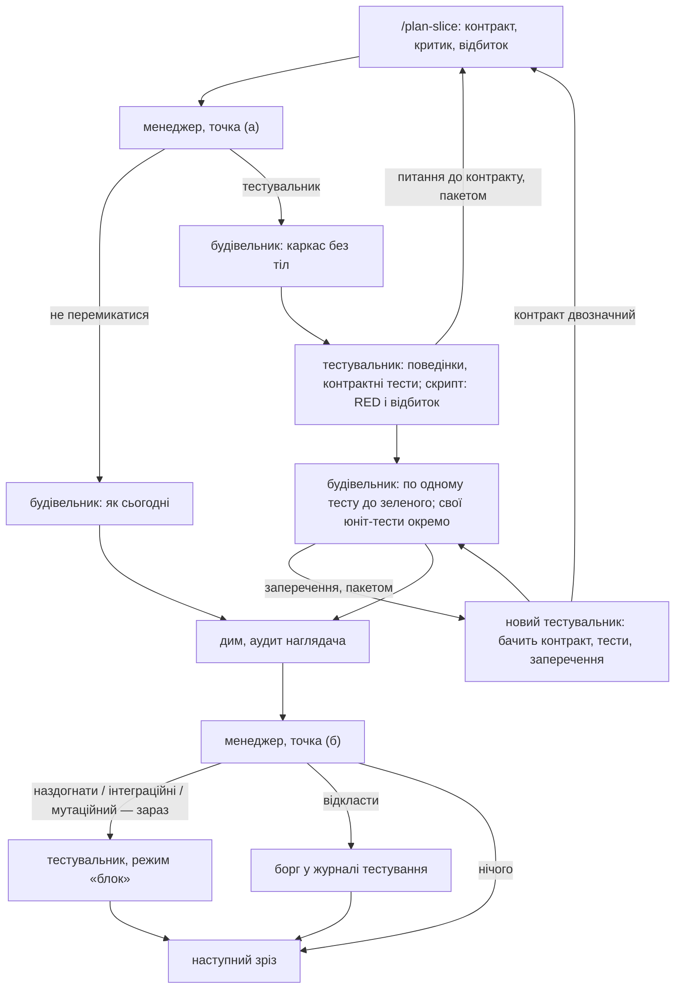

# 060 — Тестувальник і менеджер тестування: проєкт рішення (друга редакція)

Це проєкт рішення, а не збудована річ: жодного файла двигуна не змінено, платних прогонів не
було. Власник відповів на сім питань першої редакції (`060-tester-design.md` поруч, питання
1–7); відповіді внесено нижче. Вони додали нову роль — менеджера тестування, і власник сказав:
«якщо логіка його рішень потребує мого слова — поклади питання до мене, а задачу на будування —
після цього». Три місця цієї логіки таки потребують вашого слова (питання 8–10 у задачі), тож
задача знову в `blocked/`. Дослід із підсадженими помилками ви вже дозволили «до будівництва» —
він не чекає: `tasks/todo/061-tester-planted-bug-experiment.md`.

## Що змінилось для власника
- **У коді нічого.** Є друга редакція проєкту, три нові питання і одна нова задача на дошці (061).
- **Дві ролі замість однієї.**
  - **Тестувальник** (`slice-tester`) пише тести за запечатаним контрактом, не бачачи коду
    реалізації. Він нічого не вирішує про те, *чи* його кликати.
  - **Менеджер тестування** (`test-manager`) нічого не пише. Він вирішує, який вид перевірки
    потрібен і коли: незалежні контрактні тести, інтеграційні, мутаційні — або «зріз малий і
    однорідний, не перемикаємося». Його кличуть у двох точках кожного зрізу з контрактом:
    (а) контракт запечатано, код ще не почато; (б) зріз завершено.
- **Що змінили ваші відповіді проти першої редакції:**
  - правила «тестувальник на кожен зріз» немає — кличе менеджер (відповідь 2);
  - суперечки про тести розглядаються пакетом за одне коло; кожна суперечка і кожне відкладання
    записується і стоїть у вашому огляді; робота при цьому не зупиняється (відповідь 3);
  - мутаційне й інтеграційне тестування прив'язані не до кожної функції, а до завершення
    великого блока; коли саме — вирішує менеджер; порогів немає (відповіді 4, 5);
  - умови «прибрати роль» немає: після десяти живих зрізів — розбір і покращення форми
    (відповідь 6);
  - те, що тестувальника і менеджера справді покликали, перевіряє hook, а не слово моделі;
    пропозиція налаштувань піде вам на «так» у задачі будівництва (відповідь 7).
- **Чого менеджерові не дано.** Він не може скасувати кілька «обов'язкових випадків» (розділ 3):
  їх перевіряє скрипт, бо, як ви написали, «hook надійний, а модель вирішує як захоче». Саме
  про цей перелік — питання 8.
- **Конституція не змінюється.** `settings.json` зміниться лише вашим «так» у задачі будівництва.

## Проєкт рішення

### 1. Дві ролі

| | Менеджер тестування `test-manager` | Тестувальник `slice-tester` |
|---|---|---|
| Що робить | вирішує: який вид перевірки, зараз чи відкласти | пише тести за контрактом; розглядає заперечення |
| Контекст | свіжий, сліпий до розмови будівельника | свіжий, сліпий до розмови будівельника і до коду |
| Інструменти | лише читання (Read, Grep, Glob) | читання, запис файлів тестів, запуск тестів |
| Модель | модель сесії, найсильніша (як критики, `tests/test_model_roles.py`) | так само |
| Чим запускається | одним рядком, який друкує скрипт: `TESTING_REQUEST <id>` | так само |
| Вхід | файл запиту зі **фактами**, які зібрав скрипт (розділ 3), контракт, журнал тестування | контракт, каркас без тіл, звичаї тестів проєкту |
| Вихід | рішення у JSON: вид, «зараз / відкласти до … / не потрібно», причина з посиланням на факт | файли тестів, перелік поведінок, доказ RED, питання до контракту |
| Чого не робить | не пише тестів, не читає реалізації, не змінює контракт, не ставить порогів | не вирішує, чи його кликати; не пише юніт-тестів помічників; не оцінює код |

Чому менеджер — окремий агент, а не будівельник із переліком правил: будівельник зацікавлений у
відповіді «не перемикатися» (це швидше), і він уже прочитав контракт по-своєму. Чому не лише
скрипт: «малий і однорідний» та «великий блок» — судження про зміст контракту, якого скрипт не
читає. Тому поділ такий: **скрипт рахує факти і тримає обов'язкові випадки, менеджер судить
решту і пише причину словами, hook перевіряє, що обох покликали.**

Новий скрипт `.claude/hooks/testing.py` (за зразком `simplifier.py` і `overseer_verdict.py`):
`request` (збирає факти, друкує рядок запуску), `validate` (рішення менеджера не суперечить
обов'язковим випадкам), `record` (єдиний, хто пише рішення і здачу тестувальника — у
`.claude/state/testing/`, куди модель не пише), `seal` / `check` (відбиток контрактних тестів),
`ledger` (людський журнал `.engine/testing/ledger.md`: рішення, суперечки, відкладене).

### 2. Тестувальник: вхід, вихід, запечатані тести

Без змін проти першої редакції, коротко:
- **Бачить:** запечатаний контракт `.engine/slices/<slug>.md`; каркас модуля (сигнатури, типи,
  `NotImplementedError`); звичаї тестів у репозиторії. **Не бачить:** реалізації (її ще немає),
  розмови й нотаток будівельника.
- **Видає:** (1) перелік поведінок, кожна — з рядком контракту, з якого випливає («Seam», «Exit
  criterion», «Hardest seams»); поведінка без рядка — вигадана вимога і не приймається;
  (2) контрактні тести, по одному на поведінку, окремим файлом; для кожного «найтяжчого шва» —
  тест саме тим способом, який названо в контракті; (3) доказ RED; (4) питання до контракту —
  місця, де два чесні прочитання дають різні тести.
- **Доказ RED робить скрипт, а не слово агента.** Коли тестувальник закінчив, `testing.py record`
  сам запускає файл контрактних тестів проти дерева: кожен тест має впасти, і не на імпорті.
  Тест, що проходить проти каркаса, — зламаний; а якби реалізація вже існувала, тести були б
  зелені — тож той самий прогін доводить і порядок «тести до коду».
- **Запечатані тести.** Після прийнятої здачі `testing.py seal` записує відбиток файла тестів
  поруч із відбитком контракту. Будівельник файл не редагує; розбіжність із відбитком блокує
  хід ескалацією, як сьогодні зі зміненим контрактом (`contract_fingerprint.py`). Послабити
  тест, щоб він пройшов, — найдешевший вихід для будівельника, і саме його це закриває.
- **Юніт-тести помічників** і димовий скрипт лишаються за будівельником, окремим файлом, за
  нинішнім правилом «тест перед кодом».

Три режими тестувальника: **контракт** (до коду), **заперечення** (розділ 5), **блок**
(інтеграційні тести і тести на вцілілих мутантів, розділ 4).

### 3. Менеджер тестування: логіка рішень

#### Точка (а): контракт запечатано, код не почато

Питання одне: **хто пише контрактні тести цього зрізу — незалежний тестувальник чи будівельник,
як сьогодні?**

Факти, які скрипт кладе в запит (менеджер їх не шукає сам і не може «не помітити»):

| Факт | Звідки |
|---|---|
| скільки «найтяжчих швів» названо | контракт, розділ «Hardest seams» |
| чи є в «Exit criterion» поріг або число, яке ратифікував власник | контракт (Phase 4 `/plan-slice` позначає такі рядки) |
| хто споживає вихід зрізу (`contract out`) | артефакт функції, ребра графа зрізів |
| чи це трасуюча куля | артефакт функції |
| до якого блока належить зріз, що в блоці вже збудовано | артефакт функції, `.engine/PROGRESS.md` |
| що було на попередніх зрізах блока: рішення менеджера, питання до контракту, суперечки та їх кінець, блоки наглядача за перевіркою №4 | журнал тестування, вердикти наглядача |
| очікуваний розмір | розділ «Complexity budget» контракту, якщо є |

**Обов'язкові випадки — тестувальника кличуть, менеджер цього не скасовує** (`testing.py
validate` відхилить інше рішення):

| № | Умова | Чому |
|---|---|---|
| О1 | у контракті названо хоч один «найтяжчий шов» | планувальник сам сказав: тут наївний тест обманює |
| О2 | вихід зрізу споживає інший зріз або це публічний контракт | хибне прочитання розмножиться в усіх споживачах |
| О3 | у критерії готовності є поріг чи число, ратифіковані власником | це ваше рішення (стаття 5); його перевіряє той, хто не писав код |
| О4 | на попередньому зрізі цього блока суперечка скінчилась «код хибний», або тестувальник знайшов двозначність контракту, або наглядач заблокував за №4 | ця ділянка вже показала, що прочитання розходяться |

**Де судить менеджер.** Якщо жоден обов'язковий випадок не спрацював, він може вирішити «не
перемикатися» — тести пише будівельник, як сьогодні, — але лише коли виконано **обидві** умови і
він називає їх у причині:
1. **малий:** одна відповідальність, і поведінки прямо перелічені в «Exit criterion» — нема
   чого тлумачити (чисте перетворення, форматувальник, тонка обгортка з одним відображеним
   шляхом помилки — типи з `slice-builder/SKILL.md`, правило 6);
2. **однорідний:** або це черговий зріз серії однакової форми в цьому блоці, і незалежні тести
   на попередніх зрізах серії нічого не знайшли (ні питань до контракту, ні суперечок), — або
   зріз не має власної логіки розгалужень (з'єднання, налаштування, перенесення).

В усіх інших випадках, і коли він вагається, — тестувальник. Вагання коштує одного проходу
агента; пропущена спільна помилка прочитання — коштує зрізу.

Приклади:

| Зріз | Факти | Рішення |
|---|---|---|
| `apply_discount`: «знижку понад 50 % відхилити» | поріг 50 % ратифікував власник; «понад» — включно чи ні? | **тестувальник** (О3). Саме тут будівельник, який прочитав «≥», напише і тест, і код на «≥» |
| трасуюча куля функції, тонка, але її результат читають три зрізи | три споживачі | **тестувальник** (О2), хоч зріз і малий |
| четвертий із п'яти однотипних експортерів; на першому й другому тестувальник нічого не знайшов; споживачів немає | серія; попередні — чисто | **не перемикатися**; причина: «серія однорідних, незалежні тести на S1 і S2 без знахідок» |
| перейменування ключа налаштувань і його проведення крізь два виклики | жодного розгалуження, швів немає | **не перемикатися**; причина: «без власної логіки» |
| малий форматувальник дати — але на попередньому зрізі блока суперечка скінчилась «код хибний» | О4 | **тестувальник**, хоч зріз і малий |
| обгортка над зовнішнім API з повторними спробами; швів не названо, споживачів немає, серії немає | обов'язкових немає; не «однорідний» (перший такий), розгалуження є | **тестувальник** — умови «не перемикатися» не виконано |

Зріз без запечатаного контракту (будівельника запущено напряму) працює як сьогодні: менеджерові
нема про що судити.

#### Точка (б): зріз завершено (усі кроки, дим записано)

Питання: **що ще перевірити зараз, а що відкласти — і до якої події.** Менеджер відповідає по
кожному з чотирьох видів: `зараз`, `відкласти до <подія>` або `не потрібно`, з причиною.

Додаткові факти від скрипта: скільки змінено робочого коду і тестів; «самододані» поведінки
(будівельник знайшов їх посеред роботи, `slice-builder` крок 4); вердикти наглядача за зріз;
суперечки; чи цей зріз **закриває блок**; з якими вже готовими блоками цей блок з'єднаний; чи
задано `MUTATION_CMD`, коли і по чому був останній мутаційний прогін і скільки він тривав;
**відкриті борги тестування** — усе, що менеджер відклав раніше, з подією, якої воно чекає.

| Вид | «Зараз», коли | Інакше |
|---|---|---|
| **Наздогнати контрактні тести** | в точці (а) було «не перемикатися», а зріз здивував: є самододані поведінки, або наглядач блокував за №4, або розмір помітно перевищив очікуваний | не потрібно |
| **Інтеграційні тести** | цей зріз закрив блок, і блок з'єднаний хоч з одним уже готовим блоком; або закрито останній блок функції — тоді ще й критерії приймання функції | зріз має з'єднання, але блок ще не закрито → **відкласти до закриття блока**; з'єднань немає → не потрібно |
| **Мутаційний прогін** | закрито **великий** блок, у проєкті задано `MUTATION_CMD`, і по цьому блоку прогону ще не було | блок не закрито або він не великий → не потрібно; `MUTATION_CMD` порожній → не потрібно, і це один рядок у журналі |
| **Нічого** | малий зріз посеред блока, без сюрпризів | — |

**Обов'язкові випадки точки (б)** (скрипт відхилить інше рішення):

| № | Умова | Що обов'язково |
|---|---|---|
| О5 | закрито останній блок функції | інтеграційні тести на критерії приймання — зараз: далі їх відкладати нікуди, функція закривається |
| О6 | настала подія, до якої відкладено борг | борг виконується зараз; відкласти його вдруге менеджер не може |
| О7 | у точці (а) було «не перемикатися», а зріз дав самододану поведінку або блок наглядача за №4 | тестувальник наздоганяє контрактні тести зараз: передумова «малий і однорідний» не справдилась |

**Що таке блок.** Менеджер блоків не вигадує — він їх читає. `/feature-architect` у розділі
«Slices (the DAG)» позначає кожен зріз міткою блока: зрізи, які разом дають одну здатність, від
якої залежать інші. Мала функція — один блок; велика — кілька. Якщо міток немає (старий
артефакт), уся функція — один блок.

**Що таке «великий» блок** — судження менеджера, без числового порога. Блок великий, коли він
додав багато власної логіки рішень: кілька зрізів із розгалуженнями, пороги власника, шви, які
планувальник назвав тяжкими, тести, написані вже після коду. Блок із самих обгорток і з'єднань —
не великий, скільки б зрізів у ньому не було. Скрипт дає числа як факти (рядки робочого коду,
кількість функцій із розгалуженнями — з `complexity_budget.py`), але не дає межі: межа стала б
ціллю (стаття 3). Запобіжник від надто частих прогонів — не поріг, а запис: тривалість і
знахідки кожного прогону стоять у вашому огляді, і розбір після десяти зрізів це калібрує. Чи
досить вам такого означення — питання 9.

Приклади:

| Що завершено | Факти | Рішення |
|---|---|---|
| другий зріз із п'яти в блоці «ціни», сюрпризів немає | блок не закрито | нічого; інтеграційні — **відкласти до закриття блока «ціни»** (борг у журналі) |
| останній зріз блока «ціни»; блок «склад» уже готовий, і «ціни» читають його залишки | блок закрито, з'єднання з готовим | інтеграційні — **зараз**, на з'єднання «ціни ↔ склад»; борг із попереднього рядка закрито (О6). Мутаційний — **зараз**, якщо блок великий (п'ять зрізів із порогами знижок) і задано `MUTATION_CMD` |
| останній зріз функції з одного блока з двох обгорток | О5; блок не великий | інтеграційні на критерії приймання — **зараз**; мутаційний — не потрібно, причина: «обгортки, логіки рішень немає» |
| зріз, де було «не перемикатися», а будівельник дописав дві самододані поведінки | О7 | тестувальник наздоганяє контрактні тести **зараз** |
| закрито великий блок, `MUTATION_CMD` порожній | інструмента немає | мутаційний — не потрібно; у журналі й огляді рядок «великий блок без мутаційної перевірки: команду не задано» — щоб ви бачили, чого бракує |

### 4. Інтеграційні й мутаційні перевірки: як саме

**Інтеграційні тести** пише свіжий тестувальник у режимі «блок»: з артефакту функції — по тесту
на кожне з'єднання між блоками (вихід одного → вхід іншого, розділ «Inter-slice contracts») і,
коли функцію закрито, на кожен критерій приймання. Читає артефакт і публічні сигнатури, не
тіла. На рівні зрізу нічого не додається: тести зрізу вже йдуть проти справжньої системи
(`slice-builder/SKILL.md`, «Notes on test scope»), а трасуюча куля перевіряє найтонший шлях ще до
решти зрізів (`feature-architect.md`, «Tracer-bullet gate»). Ці тести пишуться, коли код уже є,
тож «спершу червоне» тут неможливе. Тому для кожного тесту тестувальник письмово називає
поломку, яку той ловить, наглядач перевіряє це як №4, а якщо по блоку йде мутаційний прогін —
він і є доказом, що тести вміють падати.

Якщо інтеграційний тест упав — це знахідка, а не суперечка: усі тести, що впали, ідуть
будівельникові одним пакетом; далі — як у розділі 5.

**Мутаційний прогін.** Двигун нічого не встановлює: у `.claude/project.env` з'являється
`MUTATION_CMD`, типово порожній; інструмент обирає і ставить власник проєкту. Прогін — лише по
файлах, які змінив блок, з межею часу. Результат — перелік уцілілих мутантів, **без оцінки і без
порога**. Менеджер розкладає вцілілих за важливістю: (1) код під порогом власника; (2) код
«найтяжчого шва»; (3) код на з'єднанні між блоками; (4) решта. Перші три класи розбираються:
свіжий тестувальник дописує тест, якщо поведінка є в контракті; якщо поведінки в контракті немає
— це код, якого ніхто не вимагав, знахідка для `simplifier`; рівнозначний мутант закривається
одним рядком пояснення. Четвертий клас іде у звіт переліком. Заборона мутаційного тестування на
рівні зрізу (`slice-builder/SKILL.md`, правило 6) лишається.

Тести властивостей (hypothesis) у проєкт не входять: контракт зрізу не має місця для інваріантів.

### 5. Суперечки, пакети і відкладання

- **Пакетом, за одне коло.** Усе, що одна сторона має сказати другій, іде одним файлом:
  тестувальник здає всі питання до контракту разом; будівельник заперечує проти всіх спірних
  тестів одним запереченням (який тест, який рядок контракту, чому); усі тести, що впали після
  інтеграційного чи мутаційного кроку, — один пакет.
- **Хто вирішує.** Новий свіжий тестувальник бачить контракт, тести і заперечення — не код — і
  по кожному пункту пакета відповідає одним із трьох: *тест хибний* (виправляє, новий відбиток);
  *тест правильний* (будівельник виправляє код); *контракт двозначний* (питання йде
  планувальникові зрізу, стаття 8).
- **Два кола на зріз; третє відкладає зріз.** Коло — це пакет, а не окремий тест. Відкладений
  зріз паркується з обома попередніми колами, і робота йде далі з наступним незаблокованим.
- **Усе записується і стоїть у вашому огляді.** Кожне коло (пункти, чим скінчився кожен) і
  кожне відкладання пише `testing.py` у `.engine/testing/ledger.md`; `board.py review` отримує
  розділ «Тестування»: суперечки з результатом («правий тест — знайдено справжню помилку в
  коді» видно окремим рядком), відкладені зрізи, рішення «не перемикатися» з причинами, відкриті
  борги тестування, мутаційні прогони (тривалість, скільки вцілілих розібрано). Власника при
  цьому ні про що не питають — це читання, не ворота.

### 6. Як це вписується в цикл зрізу

Що змінюється в кроках будівельника, коли менеджер вирішив «тестувальник»: крок 3 (перелік
поведінок) переходить до тестувальника, і окремий прохід критика по переліку зникає — автор
переліку вже свіжий і сліпий; на кроці 4 RED уже є, будівельник іде переліком по одному тесту до
зеленого з рефакторингом. Коли «не перемикатися» — кроки 0–6 як сьогодні.

**Що перевіряє hook** (відповідь 7):

| Що | Де | Як |
|---|---|---|
| менеджера і тестувальника запущено лише рядком від скрипта, без домішок у запиті | перед запуском агента — той самий обробник, що вже стереже наглядача | `testing.py guard`; потребує рядка в `settings.json` |
| рішення і здачу записав скрипт, а не модель | коли агент закінчив (SubagentStop) | `testing.py record`; потребує рядка в `settings.json` |
| зріз із запечатаним контрактом не отримає аудиту, доки немає рішення точки (а); якщо рішення «тестувальник» — доки немає прийнятої здачі і відбиток тестів не збігається | наприкінці ходу, `overseer_stop.py` (уже підключений) | відмова з ескалацією, як для зміненого контракту |
| наступний зріз не почнеться і функція не закриється без рішення точки (б) для попереднього | `testing.py request`, `/feature-architect` | відмова скрипта |

Два нові рядки в `settings.json` — ваша дія: задача будівництва покладе повний файл у
`docs/tasks/settings.json` і поставить вам питання з рядком дії `apply-settings`; до вашого «так»
працюють лише перевірки з двох останніх рядків таблиці, і у звіті буде сказано, що перші два ще
не діють.

**Чесна межа.** На першому проході сліпота тестувальника справжня: коду ще немає, і це доводить
прогін RED. На запереченні, у режимах «наздогнати» і «блок» код уже лежить у дереві; інструмент
Agent не вміє заборонити агентові читати файли, тож там сліпота тримається на правилі в його
визначенні. Це буде записано в `docs/engine-limits.md`. Окреме робоче дерево git для таких
запусків — відкладено, доки розбір після десяти зрізів не покаже, що правила недосить.

### 7. Скільки це коштує

Виміряних чисел для цих ролей немає — нижче оцінки; дослід 061 і перші зрізи дадуть справжні.
- **Менеджер:** два короткі свіжі контексти на зріз із контрактом (контракт, факти, журнал;
  нічого не пише). Найближче виміряне — відповідь аналітика на запит у свіжому контексті:
  чотири сцени «до» і «після» разом $1.17 (`tasks/done/051-business-analyst-build/report.md`).
  Моя оцінка — $0.1–0.3 за рішення.
- **Тестувальник:** один свіжий контекст на зріз, де його покликано. Найближче виміряне — аудит
  у свіжому контексті, $0.42–0.57 (`tasks/done/015-overseer-fresh-context/report.md`);
  тестувальник ще й пише та запускає тести — оцінка $0.5–1.5. Робота з написання контрактних
  тестів переїздить від будівельника, а не подвоюється.
- **Коло суперечки:** ще один свіжий контекст із малим входом; не більше двох на зріз.
- **Інтеграційні тести:** один прохід тестувальника на закритий блок.
- **Мутаційний прогін:** машинний час інструмента (хвилини або години — залежить від проєкту) і
  один прохід на розбір; рідко, лише на великому блоці.
- **Час:** зріз із тестувальником довший на два-три послідовні проходи агентів.

### 8. Як перевірити користь

**Дослід «підсаджена помилка» — до будівництва, ліміт $10** (ваша відповідь 6; задача 061). На
еталонному проєкті (`evals/reference-project`, модулі `pricing` та `inventory`) — чотири
контракти, у кожному пастка: пункт, який природно прочитати не так (межа включно чи ні;
заокруглення; порожній вхід; порядок перевірок). До кожного — реалізація, що порушує саме цей
пункт, і реалізація правильна.

| Плече | Що бачить той, хто пише тести |
|---|---|
| А (як сьогодні) | контракт **і** хибну реалізацію |
| Б (тестувальник) | лише контракт і каркас |

Пастку впіймано, коли набір тестів **падає на хибній реалізації і проходить на правильній**
(набір, що падає на обох, нічого не довів). Рахує скрипт, не модель. Вісім коротких прогонів.
Вибірка мала: дослід показує грубу різницю, не тонку. Його результат не вирішує, *чи* будувати
(ви сказали: форму міняти, від незалежних тестів не відмовлятися) — він каже, **яку форму**
будувати: якщо Б не ловить більше за А, задача будівництва почнеться зі зміни визначення
тестувальника, і це буде в її звіті.

**Безплатно, під час будівництва (тести двигуна):**
- `testing.py validate` відхиляє рішення менеджера, що суперечить кожному з О1–О7 (негативний
  випадок показано першим), і пропускає дозволене;
- `testing.py record` відхиляє здачу, де контрактний тест проходить проти каркаса;
- відбиток тестів: змінений файл блокує, незмінений проходить;
- `overseer_stop.py` не видає запиту на аудит без рішення точки (а) — показано блокування;
- `guard` відмовляє запуску менеджера і тестувальника з довільним запитом;
- структурні тести визначень (жодна роль не називає дешевшої моделі; менеджер без інструментів
  запису; бюджет контексту в межах, `tests/test_context_budget.py`);
- розділ «Тестування» в огляді показує суперечку, відкладений зріз і борг.

**Якість рішень менеджера — платно, лише з вашим лімітом (питання 10).** Одинадцять прикладів
із розділу 3 стають сценами: запит із фактами → чи рішення збігається з очікуваним і чи причина
називає той факт. Обов'язкові випадки тут перевіряються двічі: менеджер має сам дійти до них, а
скрипт — зловити, якщо не дійшов.

**У живій роботі (безплатно, у вашому огляді):** питання до контракту, знайдені до коду;
суперечки і чим скінчилися; скільки разів «не перемикатися» довелося наздоганяти (О7) — це
пряма міра помилок менеджера; блоки наглядача за №4 окремо для контрактних тестів і для тестів
будівельника; уцілілі мутанти; ціна зрізу до і після (`.claude/state/board/costs.json`). Це
показники для читання, не цілі для агента (стаття 3).

**Після десяти живих зрізів — розбір, а не вирок.** Коли в журналі тестування набереться десять
зрізів із рішенням менеджера, `testing.py` кладе на дошку задачу «розбір тестування»: що
впіймано, чого не впіймано понад наглядача, де менеджер помилився. Її результат — пропозиції
змін до визначень обох ролей, які затверджуєте ви (стаття 7: агент власного визначення не
переписує). Умови «прибрати» немає.

### 9. Що довелося б змінити (для задачі будівництва)

| Файл | Зміна |
|---|---|
| `.claude/agents/test-manager.md` (новий) | роль із розділів 1 і 3: дві точки, обов'язкові випадки, умови «не перемикатися», приклади |
| `.claude/agents/slice-tester.md` (новий) | роль із розділу 2; три режими: контракт, заперечення, блок |
| `.claude/hooks/testing.py` (новий) | `request`, `guard`, `validate`, `record`, `seal`, `check`, `ledger`; задача розбору після десяти зрізів |
| `.claude/hooks/overseer_stop.py` | без рішення точки (а) і прийнятої здачі — ескалація замість запиту на аудит |
| `.claude/skills/slice-builder/SKILL.md` | перед кроком 3 — запит до менеджера; гілка «тестувальник»; заперечення пакетом; після кроку 6 — точка (б) |
| `.claude/commands/feature-architect.md` | мітки блоків у графі зрізів; функція не закривається без рішення точки (б) і з боргом, чия подія настала |
| `.claude/commands/plan-slice.md`, `slice-planner-critic.md` | куди приходять питання до контракту; позначка ратифікованих порогів у «Exit criterion» |
| `.claude/agents/overseer.md` | №2 приймає RED, записаний скриптом; покриття «Exit criterion» контрактними тестами |
| `.claude/unattended/board_review.py` | розділ «Тестування» |
| `templates/project/.claude/project.env`, `.claude/project.env` | `MUTATION_CMD`, типово порожній |
| `docs/tasks/settings.json` | пропозиція: `guard` і `record` для двох агентів — застосовує власник відповіддю «так» |
| `docs/engine-limits.md`, `.claude/references/hooks.md`, `AGENTS.md`, `templates/project/AGENTS.md`, `.claude/ownership.txt` | межа сліпоти; нові ролі в конвеєрі; власник нових шляхів |
| `tests/`, `evals/` | перелічене в розділі 8 |

## Що я розглянув і відкинув
- **Менеджер як скрипт із таблицею правил, без агента.** Дешево й надійно, але «малий і
  однорідний» і «великий блок» — судження про зміст; скрипт або кликав би тестувальника завжди
  (це правило «на кожен зріз», яке ви відхилили), або потребував би числових порогів.
- **Менеджер як частина будівельника.** Той, кому вигідно «не перемикатися», не має це вирішувати.
- **Менеджер без обов'язкових випадків.** Тоді всю надійність тримало б слово моделі.
- **Не кликати менеджера, коли обов'язковий випадок і так вирішує** (заощадити прохід). Відкинув:
  один шлях і один запис простіші для hook-а й для огляду; повернуся до цього, якщо розбір після
  десяти зрізів покаже, що ціна помітна.
- **Числовий поріг «великого блока»** (стільки-то зрізів чи рядків). Число стає ціллю; ви двічі
  замінювали мої числа на сигнали (задача 070, відповіді 2 і 3). Лишив питанням 9.
- **Тестувальник переглядає тести після коду** як основна форма. Це вже робить наглядач (№4);
  спільної помилки прочитання не прибирає. Лишилось тільки як «наздогнати» (О7).
- **Мутаційний прогін як ворота кожного зрізу; два будівельники незалежно.** Дорого, як і в
  першій редакції.

## Демонстрація на хвилину
Показувати нічого: це проєкт. Щоб оцінити його за хвилину — дві таблиці прикладів у розділі 3
(що менеджер вирішить у точках (а) і (б)) і таблиці обов'язкових випадків О1–О7 поруч із ними.

## Витрати
Дві сесії агента (перша редакція і ця), без платних прогонів і без підагентів. Тести не
запускались: жодного `.py` чи `.sh` не змінено.

## Діапазон commit-ів
`4a216e6` (перша редакція, задача в `blocked/`) і commit цієї редакції: задача і звіт у
`tasks/blocked/`, нова задача `tasks/todo/061-tester-planted-bug-experiment.md`.

## Відкладене
- Будівництво обох ролей — окремою задачею (062) після відповідей на питання 8–10; вона врахує
  результат досліду 061.
- Робоче дерево git для тестувальника там, де код уже існує, — якщо розбір покаже потребу.
- Тести властивостей і місце для інваріантів у контракті зрізу.
- Які режими вмикають чи полегшують ці ролі — задача 080.

## Рішення, які я ухвалив сам
- Менеджер — окремий агент лише з читанням; факти збирає скрипт, обов'язкові випадки тримає
  скрипт, а не визначення агента.
- Менеджера кличуть в обох точках кожного зрізу з контрактом, навіть коли обов'язковий випадок
  уже визначає відповідь.
- У сумніві менеджер обирає тестувальника.
- Блоки позначає архітектор функції; менеджер їх читає, а не вигадує.
- Доказ RED і порядок «тести до коду» перевіряє прогін скрипта, а не запис тестувальника.
- «Два заперечення на зріз» прочитав як два кола-пакети, бо ви сказали розглядати пакетом.
- Тест, що впав після інтеграційного кроку, — знахідка для будівельника, і йде тим самим шляхом,
  що й заперечення.
- Уцілілі мутанти розкладаються за трьома класами важливості замість числа «скільки розібрати».
- Борг тестування, чия подія настала, вдруге не відкладається.
- Дослід 061 поклав у `todo/` вже зараз: ви дозволили його «до будівництва» з лімітом $10, і від
  логіки менеджера він не залежить. Якщо ви хотіли спершу побачити цю редакцію — приберіть файл
  із `todo/`, поки виконавець його не взяв.
- Задачу повернув у `blocked/`, а не в `done/`: означення «великого блока» — якісна мета, перелік
  обов'язкових випадків звужує роль, яку ви назвали «вирішує», а ліміт платних сцен — ваші гроші.
  Це стаття 5, і ви самі сказали в такому разі спершу спитати.
