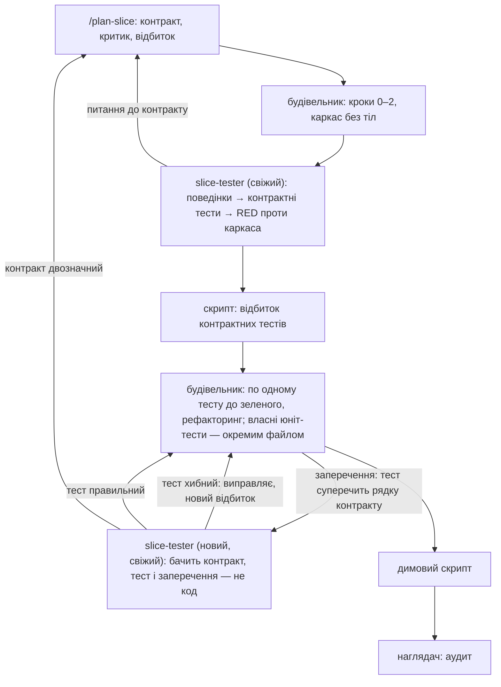

# 060 — Окремий тестувальник: проєкт рішення (чернетка звіту)

Це проєкт рішення, а не збудована річ: жодного файла двигуна не змінено, платних прогонів не
було. Задача чекає в `blocked/` на сім відповідей власника (`060-tester-design.md` поруч).
Будувати — окремою задачею після відповідей.

## Що змінилось для власника
- **У коді нічого.** Є проєкт рішення і сім питань.
- **Суть.** Тести, які доводять, що зріз виконує контракт, пише не той, хто пише код. Новий
  агент `slice-tester` у свіжому контексті отримує запечатаний контракт зрізу і порожній каркас
  (сигнатури без тіл) — і пише тести **до того, як код існує**. Йому нема чого підглянути:
  сліпота забезпечена порядком дій, а не забороною. Будівельник після цього робить тести
  зеленими, а самі ці тести змінити не може — вони запечатані відбитком, як контракт.
- **Що це дає вам.** Сьогодні `slice-builder` сам складає перелік поведінок, сам пише тест і сам
  пише код (`.claude/skills/slice-builder/SKILL.md`, кроки 3–4). Якщо він хибно прочитав
  контракт, тест і код помиляються однаково, і все зелене. Наглядач перевіряє, чи тест
  *сильний* (перевірка №4), але не чи він перевіряє *те, що написано в контракті*. Два незалежні
  прочитання контракту — єдиний спосіб побачити таку помилку без людини.
- **Побічна користь.** Тестувальник, який не може написати тест, бо контракт двозначний,
  знаходить двозначність до першого рядка коду — коли виправити її найдешевше.
- **Конституція і `settings.json` не змінюються.** Це стаття 6 («критики сліпі й свіжі»),
  поширена з планів на тести.

## Проєкт рішення

### 1. Роль, вхід і вихід

| | |
|---|---|
| Хто | агент `slice-tester` (`.claude/agents/slice-tester.md`), свіжий контекст, без власної моделі в заголовку — тобто на моделі сесії, найсильнішій (як судді й критики, `tests/test_model_roles.py`) |
| Хто запускає | будівельник, одним рядком — шляхом до контракту зрізу; нічого іншого в запиті |
| Бачить | запечатаний контракт `.engine/slices/<slug>.md` цілком; каркас модуля (сигнатури, типи, `NotImplementedError`); звичаї тестів у репозиторії (як названо, де лежать, чим запускаються) |
| Не бачить | реалізації (її ще немає), розмови будівельника, його нотаток і переліку поведінок |
| Пише | лише файли тестів і свій запис у артефакті зрізу; файлів коду не торкається |

**Що він видає:**
1. **Перелік поведінок**, кожна — з посиланням на рядок контракту, з якого вона випливає
   (розділи «Seam», «Exit criterion», «Hardest seams»). Поведінка без рядка контракту не
   приймається: це вже вигадана вимога.
2. **Контрактні тести** — по одному на поведінку, в окремому файлі
   (`test_<зріз>_contract.py` або як велить звичай проєкту). Для кожного «найтяжчого шва» з
   контракту — тест саме тим способом, який там названо.
3. **Доказ RED:** прогін усього файла проти каркаса. Кожен тест має впасти, і саме через
   `NotImplementedError`, а не через помилку імпорту чи збирання. Тест, що проходить проти
   порожнього каркаса, — зламаний тест, і тестувальник мусить його виправити до здачі.
4. **Питання до контракту** — місця, де два чесні прочитання дають різні тести. Він не вгадує:
   пише обидва прочитання і яке взяв. Це йде планувальникові зрізу, а не будівельникові.

**Чого він не робить:** не пише юніт-тестів для внутрішніх помічників (він не знає й не має
знати внутрішньої будови), не пише димового скрипта, не оцінює код, не змінює контракт.

### 2. Як це вписується в цикл зрізу

Що змінюється в кроках будівельника:

| Крок сьогодні | Після |
|---|---|
| 0–2: шов, документи, каркас | без змін |
| 3: будівельник складає перелік поведінок; без нагляду його схвалює критик | перелік складає тестувальник із контракту. Окремий прохід критика по переліку зникає: автор переліку і так свіжий і сліпий, а контракт уже пройшов критика й холодного читача |
| 4: RED → GREEN → REFACTOR, по одному тесту | RED уже є — від тестувальника, усім файлом одразу. Будівельник іде переліком по порядку: один тест до зеленого, рефакторинг, наступний. Заборона починати наступний поверх червоного чи нечищеного лишається |
| власні тести будівельника | дозволені — для помічників і розгалужень, яких не видно з контракту; в окремому файлі, за нинішнім правилом «тест перед кодом» |
| 5–6: дим, PROGRESS | без змін |

Це класична «подвійна петля»: зовнішня — приймальні тести від того, хто не писав код;
внутрішня — TDD будівельника.

**Запечатані тести.** Після здачі скрипт записує відбиток файла контрактних тестів поруч із
відбитком контракту (`contract_fingerprint.py`, той самий механізм, `.claude/state/contracts/`).
Будівельник цей файл не редагує. Якщо файл розійшовся з відбитком — наглядач не аудитує, а хід
блокується ескалацією, рівно як сьогодні зі зміненим контрактом. Послабити тест, щоб він
пройшов, — найдешевший вихід для будівельника, і саме його це закриває.

**Заперечення.** Якщо будівельник вважає, що тест суперечить контракту, він пише файл
заперечення: який тест, який рядок контракту, чому. Новий свіжий тестувальник бачить контракт,
тест і заперечення — і відповідає одним із трьох: тест хибний (виправляє, новий відбиток); тест
правильний (будівельник виправляє код); контракт двозначний (питання йде вгору, до
планувальника, — стаття 8). Не більше двох заперечень на зріз; третє паркує зріз.

**Перевірки наглядача.** №2 (вигаданий RED) для контрактних тестів закривається записом
тестувальника — це доказ від іншого агента, сильніший за нинішній. №4 (слабкий тест) лишається і
застосовується до обох файлів. Додається одне: чи кожен рядок «Exit criterion» має контрактний
тест.

**Коли тестувальника немає.** Зріз без запечатаного контракту (будівельника запущено напряму,
без `/plan-slice`) працює як сьогодні: тестувальникові нема з чого писати. Чи кликати його на
кожен зріз із контрактом — питання 2.

**Чесна межа.** На першому проході сліпота справжня: коду ще не існує. На розгляді заперечення
код уже лежить у дереві, і інструмент Agent не вміє заборонити агентові читати файли — там
сліпота тримається на правилі в його визначенні. Якщо цього мало, тестувальника на запереченні
можна запускати в окремому робочому дереві git, знятому з commit-а каркаса; це дорожче в
будівництві, і я б додавав це лише коли проба покаже, що правила недосить. Це місце має бути
записане в `docs/engine-limits.md`.

### 3. Скільки це коштує

Виміряних чисел для цієї ролі немає — нижче оцінки.
- **Що додається:** один свіжий контекст на зріз, який читає контракт і звичаї тестів і пише
  тести. Найближче виміряне — аудит у свіжому контексті: $0.42–0.57 за прогін
  (`tasks/done/015-overseer-fresh-context/report.md:153`). Тестувальник ще й пише та запускає
  тести, тож моя оцінка — $0.5–1.5 на зріз.
- **Що зникає:** будівельник не пише контрактних тестів (ця робота переїздить, а не
  подвоюється), і без нагляду зникає прохід критика по переліку поведінок.
- **Чистий додаток** — здебільшого повторне читання контракту свіжим контекстом. Очікую значно
  менше ніж подвоєння ціни зрізу, але це треба виміряти (розділ 5).
- **Заперечення** — ще один свіжий контекст із малим входом кожне; не більше двох на зріз.
- **Час:** зріз стає довшим на один послідовний прохід агента.
- **Ризик нової ціни:** будівельник і тестувальник можуть сперечатися через двозначний контракт.
  Це обмежено двома запереченнями, і кожне таке — насправді вада контракту, знайдена до аудиту.

### 4. Мутаційне та інтеграційне тестування: чи і коли

**Мутаційне тестування** (у код навмисно вносять дрібні помилки й дивляться, чи тести це
помічають) — механічна форма перевірки №4. Сьогодні на рівні зрізу воно прямо заборонене
(`slice-builder/SKILL.md:54`, `slice-planner-critic.md:121`) — як роздування зрізу. Пропоную:

| Де | Чи потрібне | Чому |
|---|---|---|
| На кожному зрізі, як ворота | **ні** | повільно; а частка «вбитих мутантів» як ціль — це стаття 3: тести почнуть писати під число |
| Наприкінці функції, один раз, лише по файлах, які функція змінила, з межею часу | **так, якщо проєкт задав команду** | це єдиний дешевий доказ, що тести, написані вже після коду (інтеграційні, нижче), узагалі здатні впасти — урок двигуна «тест нічого не доводить, доки не впав із правильної причини» (`.engine/overseer/MEMORY.md:24`) |
| У перевірці користі тестувальника (розділ 5) | **так** | як лінійка, а не як ворота |

Як саме:
- Двигун нічого не встановлює. У `.claude/project.env` з'являється `MUTATION_CMD`, типово
  порожній — тоді кроку немає, як із `LINT_CMD`. Інструмент (для Python — mutmut чи cosmic-ray)
  обирає і ставить власник проєкту: додавання пакетів — дія лише за його словом.
- Результат — **перелік уцілілих мутантів, а не оцінка**. Жодного порога. Кожен уцілілий — одне
  з двох: бракує тесту (тоді тестувальник у свіжому контексті дописує його, якщо поведінка є в
  контракті) або код, якого жоден контракт не вимагає (тоді це знахідка для `simplifier`).
  Третій випадок — рівнозначний мутант — закривається одним рядком пояснення.
- Розбір обмежено: не більше N уцілілих на функцію, решта — у звіт (N — питання 4).

**Інтеграційне тестування.** Тут двигун уже має більше, ніж здається: тести зрізу типово йдуть
проти справжньої зовнішньої системи (`slice-builder/SKILL.md:241`), зріз закривається димовим
прогоном, а на початку функції «трасуюча куля» доводить, що частини з'єднуються
(`feature-architect.md:138`). Прогалина одна: трасуюча куля перевіряє найтонший шлях **до**
того, як збудовано решту зрізів. Після останнього зрізу ніщо окремо не перевіряє, що з'єднання
між зрізами — такі, як записано в контракті функції.

| Де | Чи потрібне | Хто і з чого |
|---|---|---|
| На рівні зрізу, додатково | **ні** | уже є |
| Наприкінці функції | **так** | свіжий тестувальник, із артефакту функції: по одному тесту на кожен критерій приймання і на кожне ребро графа зрізів («contract out» одного зрізу → вхід іншого). Читає артефакт функції і публічні сигнатури, не тіла |
| Між функціями | **ні, поки що** | це «ходячий кістяк» архітектора (`master-architect.md:156`); окремого рішення не пропоную |

Ці тести пишуться, коли код уже є, тож RED першим тут неможливий. Саме тому їм потрібен доказ,
що вони вміють падати, — мутаційний прогін наприкінці функції, якщо команду задано; якщо ні —
тестувальник для кожного тесту письмово називає поломку, яку той ловить, а наглядач перевіряє
це як №4.

Тести властивостей (hypothesis) у цей проєкт не входять: окрема тема, і контракт зрізу сьогодні
не має місця для інваріантів.

### 5. Як перевірити користь

**Безплатно, під час будівництва (тести двигуна):**
- скрипт відбитка відмовляє, коли запечатаний файл тестів змінено (негативний випадок показано
  першим), і пропускає незмінений;
- структурні тести визначень: `slice-tester` не називає дешевшої моделі; у визначенні
  будівельника більше немає «склади перелік поведінок і напиши тест», а є «не редагуй
  контрактні тести»; бюджет контексту не зріс (`tests/test_context_budget.py`);
- сцена для воріт: каркас, проти якого контрактний тест проходить, — здача відхиляється.

**Платно, лише з вашого дозволу (питання 5) — дослід «підсаджена помилка».** Він міряє саме
ту схильність, яку названо в задачі. На еталонному проєкті (`evals/reference-project`,
модулі `pricing` та `inventory`) — чотири контракти, у кожному пастка: пункт, який природно
прочитати не так (межа включно чи ні; заокруглення; порожній вхід; порядок перевірок). До
кожного — реалізація, яка порушує саме цей пункт.

| Плече | Що бачить той, хто пише тести | Питання |
|---|---|---|
| А (як сьогодні) | контракт **і** хибну реалізацію | чи його тести падають на цій реалізації, чи узаконюють помилку? |
| Б (тестувальник) | лише контракт і каркас | те саме: чи його тести падають на хибній реалізації? |

Корисно, якщо Б ловить пастки, які А пропускає. Якщо обидва ловлять однаково — роль не дає
того, заради чого задумана, і будувати її не варто. Вісім коротких прогонів (чотири сцени × два
плеча), кожен — лише написання тестів, без будівництва зрізу; моя оцінка — до $10. Вибірка
мала, і це слід казати прямо: дослід здатен показати грубу різницю, не тонку. Плече А —
наближення: справжній будівельник пише тест до коду, але в тому самому контексті, з тим самим
прочитанням.

Якщо в проєкті задано `MUTATION_CMD` — додатково порівняти кількість уцілілих мутантів у
наборах А і Б; без нього цей вимір пропускається.

**У живій роботі (безплатно, з файлів, у вашому огляді):**
- питання до контракту, знайдені до коду, — скільки на зріз;
- заперечення та чим скінчилися: тест хибний / код хибний / контракт двозначний;
- блоки наглядача №4 окремо для контрактних тестів і для тестів будівельника;
- уцілілі мутанти наприкінці функції (де є команда);
- ціна зрізу до і після (`.claude/state/board/costs.json`).

Це показники для читання, а не цілі для агента (стаття 3).

**Умова «прибрати».** Якщо після перших кількох зрізів тестувальник не знайшов жодного питання
до контракту, жодне заперечення не скінчилося на «код хибний», а блоків №4 не поменшало —
роль не окупилася, і її слід прибрати. Скільки зрізів чекати — питання 6.

### 6. Що довелося б змінити (для задачі будівництва)

| Файл | Зміна |
|---|---|
| `.claude/agents/slice-tester.md` (новий) | роль із розділу 1; три режими: зріз, заперечення, функція |
| `.claude/skills/slice-builder/SKILL.md` | крок 3 → запуск тестувальника; крок 4 → зелене по черзі; правило про запечатані тести й заперечення |
| `.claude/hooks/contract_fingerprint.py` | відбиток файла контрактних тестів поруч із відбитком контракту |
| `.claude/agents/overseer.md` | №2 приймає RED тестувальника; покриття «Exit criterion» контрактними тестами |
| `.claude/commands/feature-architect.md` | інтеграційні тести й мутаційний прогін перед закриттям функції |
| `.claude/commands/plan-slice.md`, `slice-planner-critic.md` | куди приходять питання до контракту; рядок про мутації на рівні функції |
| `templates/project/.claude/project.env`, `.claude/project.env` | `MUTATION_CMD`, типово порожній |
| `docs/engine-limits.md`, `AGENTS.md`, `templates/project/AGENTS.md` | межа сліпоти; нова роль у конвеєрі |
| `tests/`, `evals/` | перелічене в розділі 5 |

Конституція і `settings.json` — без змін. Якщо ви захочете, щоб запуск тестувальника перевіряв
hook (як запуск наглядача в задачі 018), — це вже зміна `settings.json` і ваша дія; у цьому
проєкті я цього не закладаю (питання 7).

## Що я розглянув і відкинув
- **Тестувальник переглядає тести після коду.** Це вже робить наглядач перевіркою №4; спільної
  помилки прочитання це не прибирає, бо читач бачить код і тягнеться до його логіки.
- **Тестувальник пише всі тести, і юніт-тести помічників теж.** Для цього треба бачити
  внутрішню будову — тобто код.
- **Сліпота, яку тримає hook** (заборона читати код для цього агента). Потребує змін у
  `settings.json` і розпізнавання агента в hook-у; порядок дій дає те саме на першому проході
  задарма.
- **Мутаційний прогін як ворота кожного зрізу з порогом.** Дорого, і число стає ціллю.
- **Два будівельники незалежно, результати порівнюються.** Подвоює найдорожчу частину.

## Демонстрація на хвилину
Показувати нічого: це проєкт. Щоб оцінити його за хвилину, подивіться на схему в розділі 2 і на
таблицю двох плечей досліду в розділі 5.

## Витрати
Одна сесія агента, без платних прогонів, без підагентів. Тести не запускались — жодного `.py`
чи `.sh` не змінено.

## Діапазон commit-ів
Один commit дошки: задача і цей звіт у `tasks/blocked/`.

## Відкладене
- Саме будівництво — окремою задачею після ваших відповідей.
- Робоче дерево git для тестувальника на запереченні — лише якщо проба покаже потребу.
- Тести властивостей і місце для інваріантів у контракті зрізу.
- Які режими вмикають тестувальника — вирішується в задачі 080.

## Рішення, які я ухвалив сам
- Сліпота через порядок дій (тести до коду), а не через заборону читати.
- Тестувальник пише лише контрактні тести; юніт-тести помічників лишаються за будівельником.
- Контрактні тести запечатуються тим самим скриптом, що й контракт; суперечку розв'язує новий
  свіжий тестувальник, а не будівельник і не наглядач.
- Без контракту зрізу тестувальника не кличуть.
- Мутаційний результат — перелік, без порога; двигун інструмент не встановлює.
- Димовий скрипт лишається за будівельником: йому потрібні справжні залежності й знання, як
  модуль підключено.
- Питання поставив, а задачу переніс у `blocked/`, не в `done/`: так написано в самій задачі і
  так зроблено з 015 і 050; у `done/` вона піде зі схваленим проєктом після відповідей.
