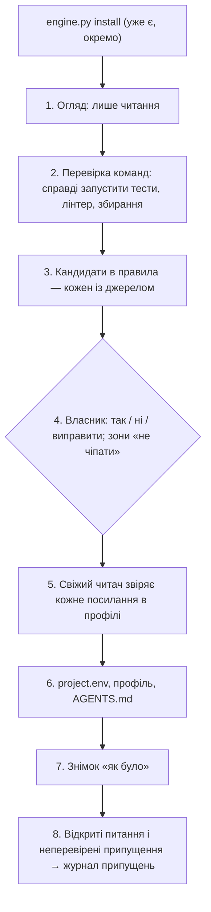
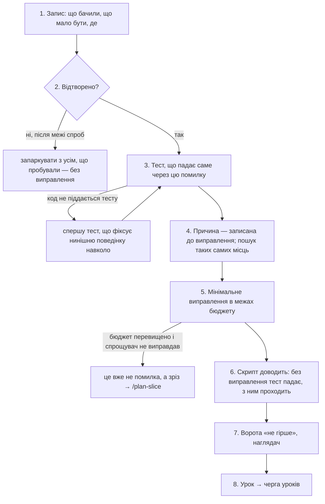

# 070 — Супровід наявного коду: проєкт рішення (чернетка звіту)

Це проєкт рішення, а не збудована річ: жодного файла двигуна не змінено, платних прогонів не
було. Задача чекає в `blocked/` на вісім відповідей власника (`070-supervision-design.md`
поруч). Будувати — окремими задачами після відповідей (розділ 9).

## Що змінилось для власника
- **У коді нічого.** Є проєкт рішення і вісім питань.
- **Суть.** Двигун сьогодні вміє будувати нове: кожен зріз має контракт, тести й чисті ворота.
  Чужий код цього не має — у ньому вже є тести, що падають, зауваження лінтера і місця без
  жодного тесту. Якщо поставити двигун у такий проєкт як є, ворота наприкінці ходу блокуватимуть
  кожен хід через чужі старі помилки, а після третього блоку пропускатимуть хід з ескалацією
  (`.claude/references/gate.md:34`) — тобто або заважатимуть, або нічого не захищатимуть.
- **Одна основа і чотири команди на ній.** Основа — **знімок «як було»**: що в проєкті вже
  зламано на день знайомства. Ворота після цього питають не «чи все чисто», а «чи не стало
  гірше». На цій основі стоять `/onboard` (знайомство і сам знімок), `/bugfix` (повне
  виправлення), `/hotfix` (термінове виправлення з боргом) і `/maintain` (регулярний догляд).
- **Два нові захисти у воротах:** код, якого не захищає жоден тест, не можна видалити, доки
  його поведінку не зафіксовано тестом; термінове виправлення має жорстку межу розміру.
- **Конституція і `settings.json` не змінюються.** Усі нові перевірки живуть усередині
  `gate.py`, який уже підключено; команди — це файли в `.claude/commands/`.

## Проєкт рішення

### 1. Основа: знімок «як було» і правило «не гірше, ніж було»

**Що записується.** Один файл проєкту — `.engine/baseline.json`, його пише лише скрипт
(`baseline.py record`), він комітиться разом із проєктом.

| Що міряємо | Як записано | Що означає «гірше» |
|---|---|---|
| Тести | перелік імен тестів, що падають на день знімка | упав тест, якого немає в переліку |
| Лінтер | число зауважень на пару «файл, правило» | у файлі, який хід змінив, число для якогось правила зросло |
| Типи | число помилок на файл | те саме |
| Складність | уже є: рахуються лише функції, які зміна додала чи погіршила (`.claude/references/complexity-budget.md:46`) | без змін |
| Тривалість тестів | скільки триває повний прогін | не міряється як «гірше»; потрібна, щоб обрати, що ганяти наприкінці ходу |

Числа на пару «файл, правило», а не номери рядків: рядки з'їжджають від кожної правки, число — ні.

**Знімок лише стискається.** Тест із переліку почав проходити — скрипт прибирає його з переліку
(`baseline.py tighten`), і надалі його падіння вже блокує. Те саме з числами: стало менше —
записується менше. Так проєкт поволі чистішає без окремої задачі «виправити все».

**Послабити знімок агент не може.** Зміна, що *додає* рядок до переліку чи *збільшує* число, —
це той самий обхід воріт, що й доданий `# noqa`: її ловить наявний «захист від обходу»
(`.claude/references/gate.md:42`), до якого файл знімка додається ще одним рядком. Послабити
може лише власник: перезняти знімок у сесії знайомства або власноруч.

**Чого знімок не робить.** Він не виправдовує старе: кожен рядок у ньому — видимий борг, і огляд
дошки показує, скільки їх лишилося. Покриття тестами у знімок не входить (питання 1): відсоток
покриття як ціль — це стаття 3, тести почнуть писати під число.

**Коли знімка немає** (проєкт, збудований двигуном із нуля) — усе працює як сьогодні: порожній
знімок означає «має бути чисто».

**Чесна межа.** Ворота наприкінці ходу перевіряють лише змінені файли й тести, що до них
належать (`gate.md:27`). Тест, який зламала правка в іншому модулі, побачить лише повний прогін
перед commit-ом. У чужому коді зв'язки між модулями гірше відомі, тож тут ця межа важить більше;
її слід дописати до `docs/engine-limits.md`.

### 2. `/onboard` — знайомство з проєктом разом із власником

Це задача з присутнім власником (`Потрібна присутність власника: так`): правила проєкту знає
людина, а не код. Без власника агент може зробити лише кроки 1–2 і зупинитися з питаннями.

1. **Огляд, лише читання.** Мови й будова тек; чим проєкт збирається, тестується й перевіряється
   (з файлів CI, Makefile, маніфестів пакетів); залежності; наявні документи й рішення; історія
   git — які файли змінюються найчастіше і водночас найскладніші (це місця, де найімовірніше
   доведеться працювати). Великий проєкт читається не весь: спершу гарячі місця, і в профілі
   прямо написано, що не прочитано.
2. **Перевірка команд.** Кожну знайдену команду агент запускає і записує вивід: чи працює,
   скільки триває, що падає. Команда, якої не запускали, у `project.env` не потрапляє — це
   стаття 1: неперевірене припущення про чужу систему.
3. **Відновлення правил.** Агент складає кандидатів у правила з трьох джерел і позначає, з якого:
   - *записане* — у документах, налаштуваннях лінтера, CI («тести обов'язкові для `api/`»);
   - *видиме з коду* — звичай, якого тримається переважна більшість файлів, із переліком
     файлів, що його тримаються, і тих, що ні;
   - *видиме з історії* — повернуті зміни, повторювані виправлення того самого місця.

   Кандидат без джерела не подається (стаття 4). Здогад агент називає здогадом.
4. **Рішення власника.** На кожного кандидата — «так», «ні» або виправлений текст. Окремо
   власник називає зони «не чіпати»: згенероване, чуже вбудоване, те, що ось-ось приберуть.
   Вони йдуть у наявний `SIMPLIFIER_PROTECTED` і в профіль.
5. **Свіжий читач.** Агент у новому контексті отримує лише профіль і перевіряє одне: чи кожне
   посилання справді каже те, що йому приписано. Це стаття 6, застосована до опису проєкту:
   автор профілю щойно прочитав тисячі рядків і схильний бачити порядок там, де його немає.
6. **Що лишається після знайомства:**

   | Файл | Що в ньому | Хто читає |
   |---|---|---|
   | `.engine/onboard/profile.md` | карта проєкту; команди з доказом запуску; усі правила з вердиктом власника і джерелом; зони ризику (є тести / немає тестів / не чіпати); що не прочитано | `/bugfix`, `/hotfix`, архітектори та їхні критики — на вимогу |
   | `AGENTS.md` проєкту | коротке: одне речення про проєкт, ключові шляхи, кілька правил, які потрібні в кожній розмові | кожна розмова |
   | `.claude/project.env` | `SOURCE_DIRS`, розширення, команди перевірок | ворота |
   | `.engine/baseline.json` | знімок із розділу 1 | ворота |
   | `.engine/premises/premise-log.md` | припущення про проєкт, яких не вдалося перевірити | усі рівні (стаття 8) |

   `AGENTS.md` складає наявна навичка `documentation` (у неї вже є шлях для проєкту без
   документів, `.claude/skills/documentation/SKILL.md:66`) — нової не пишемо.
7. **Пороги складності** калібруються на коді проєкту наявною командою
   (`complexity_budget.py calibrate`); застосовує їх власник, як і сьогодні.

**Чого `/onboard` не робить:** нічого не виправляє і не впорядковує; не вигадує заднім числом
архітектурних рішень (ADR) — будову записано як «так є», а не «так вирішено»; не встановлює
двигун (це `engine.py install`) і не ставить жодних інструментів.

**Куди йдуть відновлені правила.** Постійний контекст обмежено 200 рядками
(`tests/test_context_budget.py`; сьогодні в двигуні 191), а до `.engine/rules.md` рядок
потрапляє лише через вашу відповідь на пропозицію уроку. Тому пропоную: усі підтверджені правила
лежать у профілі, а в `AGENTS.md` проєкту — лише ті кілька, без яких будь-яка розмова помилиться
(скільки — питання 2). Решту команди супроводу читають із профілю самі.

### 3. `/bugfix` — повне виправлення помилки

1. **Запис помилки** — `.engine/bugs/<номер-назва>.md`: ознака, очікуване, фактичне, де
   помічено. Цей файл — водночас і контракт, і звіт виправлення; наглядач перевіряє за ним.
2. **Відтворення.** Команда і вивід, що показують помилку. Якщо за обмежену кількість спроб
   відтворити не вдалося — задача паркується з переліком спробуваного. Виправлення навмання
   немає: «я знаю, де помилка» без відтворення — неперевірене припущення (стаття 1).
3. **Тест, що падає** — на тому рівні, де помилку видно користувачеві, і з правильної причини.
   Якщо до коду немає як підступитися тестом — спершу пишеться тест, який фіксує нинішню
   поведінку сусіднього коду, і лише тоді найменший шов для тесту помилки.
4. **Причина** записується до того, як написано виправлення, і відрізняє *де проявилося* від
   *чому сталося*. Далі — пошук таких самих місць у проєкті. Знайдені сусіди з тією самою
   причиною виправляються тут же, якщо вміщуються в бюджет; інакше — стають новими задачами.
5. **Мінімальне виправлення.** Запис помилки має готовий малий бюджет складності: нуль нових
   файлів, нуль нових публічних імен, нуль абстракцій, нуль залежностей, обмежене число рядків
   (питання 3). Перевищення, як і сьогодні, не забороняє, а кличе спрощувача. Якщо він не
   виправдав — це не виправлення помилки, а зріз, і він іде через `/plan-slice`. Жодного
   впорядкування «заодно».
6. **Механічний доказ.** Скрипт (`bugfix.py prove`) у тимчасовій робочій копії бере код *до*
   виправлення разом із новим тестом — тест мусить упасти; потім код *після* — мусить пройти.
   Сьогодні «тест справді падав» — це твердження будівельника, яке наглядач перевіряє за
   записами (перевірка №2). Тут це перевіряє програма, і коштує це секунди.
7. **Ворота й наглядач** — як для звичайного зрізу, із правилом «не гірше». Регресійний тест
   лишається в наборі назавжди.
8. **Урок.** Одне питання: чому це не спіймали раніше — бракувало тесту, контракт був хибний,
   бракувало правила, чи причина зовнішня. Відповідь іде кандидатом у наявну чергу уроків
   (`lesson_queue.py`); правилом вона стає лише через вас, як і сьогодні.

**Коли це не помилка.** Якщо «очікуване» ніде не записане і його не можна вивести з профілю чи
цілей — це продуктове рішення (стаття 5), і воно йде питанням до вас, а не виправляється.

**Окремий тестувальник (задача 060).** Тут він не кличеться: він пише тести з контракту зрізу,
а в помилки контракту немає. Сліпоту йому замінює механічний доказ із кроку 6.

### 4. `/hotfix` — термінове виправлення

Терміновість знімає *церемонію*, а не *перевірки*.

| | `/bugfix` | `/hotfix` |
|---|---|---|
| Хто оголошує | будь-яка задача | **лише власник** — рядком у задачі або в сесії. Агент сам роботу терміновою не називає: це був би спосіб обійти церемонію (стаття 3) |
| Відтворення | обов'язкове | обов'язкове; або слова власника про ознаку, записані як є |
| Тест перед кодом | так | можна відкласти — **у борг** |
| Причина | до виправлення | можна відкласти — **у борг** |
| Пошук таких самих місць | так | відкладено в борг |
| Розмір | бюджет-очікування, перевищення кличе спрощувача | **жорстка межа**, перевищення блокує |
| Ворота «не гірше», захист від обходу | так | **так, без винятків** |
| Наглядач | так | так (питання 4) |
| Як відкотити | — | записано в картці: одна команда або один commit |

**Спершу — чи не простіше відкотити.** Перший крок `/hotfix` — знайти зміну, що внесла
помилку. Якщо її можна просто повернути, агент пропонує саме це; `git revert` — дія лише за
вашим словом, тож він готує команду, а не виконує.

**Межа розміру.** Картка термінового виправлення несе той самий розділ бюджету складності, що й
контракт зрізу, але з позначкою «жорстко»: нуль нових файлів, нуль залежностей, нуль нових
публічних імен, малі числа рядків і файлів (питання 4), жодного видалення коду поза функціями,
які правляться. Перевищення не кличе спрощувача, а блокує з текстом: «це не термінове
виправлення — або зменш, або `/bugfix`». Механізм готовий: `complexity_budget.py` уже рахує ці
числа від базового commit-а; додається лише жорсткий режим для картки.

**Борг.** Кожне термінове виправлення лишає два сліди, і обидва робить скрипт, а не пам'ять
агента:
- рядок у `.engine/debt.md`: що відкладено (тест, причина, пошук сусідів), commit, дата, строк;
- задача на дошці `tasks/todo/NNN-hotfix-followup-…md` — повний `/bugfix` для того самого місця.

Огляд дошки показує відкриті борги окремим рядком, прострочені — в «Аномаліях». Поки відкритих
боргів більше за дозволене число, нове термінове виправлення починається з питання до вас
(питання 4): інакше «терміново» стає звичайним способом працювати.

**Чого `/hotfix` не робить:** не викладає на сервер і не надсилає гілку (це ваші дії); не
чіпає міграцій і налаштувань перевірок.

### 5. `/maintain` — регулярний догляд

Дві частини, і різняться вони тим, що агентові дозволено.

**А. Залежності.**
1. *Звіт (без нагляду, лише читання):* що застаріло, на скільки (латка / мала / велика версія),
   що має відомі вразливості. Команди задає проєкт у `project.env` — `DEPS_OUTDATED_CMD`,
   `DEPS_AUDIT_CMD`, типово порожні (тоді кроку немає). Двигун нічого не встановлює.
2. *Оновлення:* по одній залежності (латки можна групою) — оновити, повний прогін тестів,
   ворота «не гірше», окремий commit. Оновлення, після якого щось упало, скасовується і йде у
   звіт із виводом. Велика версія ніколи не оновлюється в догляді: це окрема задача, бо там
   треба читати, що зламано навмисно.
3. *Хто запускає оновлення.* Зміна пакетів — дія лише за вашим словом
   (`.claude/engine-rules.md:20`), і без нагляду агент її не викликає взагалі. Тому догляд
   закінчується питанням «оновити ці N залежностей?» із переліком; на «так» команду
   `DEPS_UPDATE_CMD` виконує виконавець — так само, як він уже застосовує пропозицію
   налаштувань чи робить урок правилом (`.claude/unattended/owner_action.py:97`). Це нова дія в
   його короткому переліку (питання 6).

**Б. Звіт про складність.** Майже все вже є: `simplifier.py nightly` рахує сигнали по всьому
проєкту, веде історію і каже, чи кликати спрощувача (`.claude/references/simplifier.md:26`).
`/maintain` збирає з цього один документ `.engine/maintain/<дата>.md`:
- складність, мертвий код, дублювання, невживані залежності — проти минулого звіту;
- гарячі місця: файли, що і часто змінюються, і складні;
- знімок «як було»: скільки старих падінь і зауважень лишилося, скільки прибрано;
- відкриті борги термінових виправлень;
- черга уроків і чи час прибирати пам'ять.

Сам догляд нічого не видаляє й не впорядковує: знахідки спрощувача йдуть його звичним шляхом,
а все, що варте роботи, стає пропозиціями задач у звіті.

**Розклад.** Двигун нічого не планує сам (так само, як нічне прибирання). Догляд — це задача на
дошці, яку виконавець після закриття кладе знову з наступною датою (питання 6).

### 6. Захист від видалення коду без тесту

**Що ловимо.** Зміна прибирає функцію, клас або файл робочого коду (чи багато рядків усередині
функції), і жоден тест цього коду не торкався. Після такої зміни всі тести зелені — бо їх і не
було, — і ніхто не дізнається, що зникла потрібна поведінка. У чужому коді це найдорожча з
дешевих помилок.

**Як ворота це бачать** (перевірка в `gate.py`, шари «кінець ходу» і «перед commit-ом»):
- *що видалено* — із різниці git: зниклі функції, класи, файли. Перенесення не рахується:
  якщо ім'я з'явилося в іншому місці тієї самої зміни, це не видалення;
- *чи був тест* — двома способами, точніший має перевагу:
  1. проєкт задав `COVERAGE_CMD` — тоді видно, чи виконувалися ці рядки під тестами;
  2. не задав — за наявною відповідністю «модуль → його файл тестів» (`gate.md:19`) і за
     згадкою імені в тестах.

**Як пройти захист** — три чесні шляхи:
1. написати тест, що фіксує нинішню поведінку, показати, що він проходить на коді *до*
   видалення (той самий скрипт із розділу 3, у зворотний бік), і тоді видаляти;
2. довести, що код мертвий: знахідка спрощувача з доказом від інструмента — і ваше
   підтвердження. Це його наявний шлях: код без тестового захисту він і так не має права
   прибирати сам (`simplifier.md:43`);
3. ваш дозвіл у запечатаному контракті (`gate-allow`, як сьогодні для інших обходів).

**Чесні межі.** «Рядок виконувався під тестом» не означає «тест перевіряв результат» — це межа
будь-якого покриття. Без `COVERAGE_CMD` перевірка грубша і для мов, крім Python, зводиться до
підрахунку видалених рядків. Обидва пункти — для `docs/engine-limits.md`.

### 7. Як команди лягають на наявний конвеєр

| Команда | Що з наявного бере | Що нове |
|---|---|---|
| `/onboard` | `engine.py install`, навичка `documentation`, `complexity_budget.py calibrate`, журнал припущень | профіль, знімок, свіжий читач посилань |
| `/bugfix` | будівельник зрізу, бюджет складності, ворота, наглядач, черга уроків | запис помилки, механічний доказ |
| `/hotfix` | те саме | жорсткий бюджет, борг, задача-продовження |
| `/maintain` | `simplifier.py nightly`, сигнали, огляд дошки | звіт, дія виконавця «оновити залежності» |

Сходинки, коли робота переростає свою команду: термінове → повне виправлення → зріз
(`/plan-slice`) → функція (`/feature-architect`). Униз агент сам не спускається.

**Де записано тип роботи.** У картці самої роботи (`.engine/bugs/<…>.md`, поле «тип»), яку
ворота читають так само, як сьогодні бюджет із контракту зрізу. Окремого перемикача режиму цей
проєкт не вводить: що таке режим і де він живе — задача 080.

### 8. Скільки це коштує і як перевірити користь

Виміряних чисел для цих команд немає — нижче оцінки.
- `/onboard` — одна довга сесія з власником і один свіжий читач; залежить від розміру проєкту.
  Найближче виміряне — свіжий аудит за $0.42–0.57 (`tasks/done/015-overseer-fresh-context/report.md:153`);
  читач посилань має бути того ж порядку, сама сесія — в рази дорожча.
- `/bugfix` — як зріз без кола планувальника з критиком, тобто дешевше за зріз.
- `/hotfix` — дешевше за `/bugfix` зараз і стільки ж потім: борг — це відкладений `/bugfix`.
- `/maintain` — звіт рахують скрипти, майже задарма; спрощувач кличеться лише за сигналом.
- Знімок і обидва захисти — це код воріт: у роботі нічого не коштують.

**Безплатно, під час будівництва** (сцени для воріт, негативний випадок першим):
- у проєкті три старі падіння тестів; агент додає четверте — блок; не додає — хід проходить;
- агент дописує рядок у знімок — блок; старий тест полагоджено — знімок стиснувся;
- видалено функцію без тесту — блок; з тестом — проходить; перенесено — проходить;
- термінове виправлення більше за межу — блок; у межах — проходить, борг і задача створені;
- `bugfix.py prove` відмовляє, коли тест проходить і без виправлення.

**У живій роботі** (з файлів, у вашому огляді): скільки рядків лишилось у знімку; скільки разів
спрацював захист від видалення і чим скінчилося; скільки термінових боргів закрито вчасно; чи
повертаються виправлені помилки. Це показники для читання, не цілі для агента (стаття 3).

**Проба на справжньому проєкті.** `/onboard` не можна чесно перевірити на еталонному проєкті
двигуна: той малий і чистий. Потрібен справжній чужий репозиторій, який назвете ви (питання 8).

### 9. Що довелося б змінити і в якій черзі будувати

| Задача будівництва | Файли |
|---|---|
| А. Знімок і правило «не гірше» | `.claude/hooks/baseline.py` (новий), `gate.py`, `references/gate.md`, шаблон `project.env`, `ownership.txt`, тести й сцени |
| Б. Захист від видалення | `gate.py`, `COVERAGE_CMD` у `project.env`, `docs/engine-limits.md`, тести й сцени |
| В. `/onboard` | `.claude/commands/onboard.md`, шаблон профілю, `docs/TEMPLATE-SETUP.md`, шаблон задачі дошки з присутнім власником |
| Г. `/bugfix` | `.claude/commands/bugfix.md`, шаблон запису помилки, `bugfix.py prove`, рядок у `overseer.md` |
| Ґ. `/hotfix` | `.claude/commands/hotfix.md`, жорсткий режим у `complexity_budget.py`, `.engine/debt.md`, рядок боргів у `board_review.py` |
| Д. `/maintain` | `.claude/commands/maintain.md`, дія `update-deps` в `owner_action.py`, `DEPS_*` у `project.env` |

Черга саме така: А потрібна всім, Б — незалежна й корисна одразу, В дає профіль, на який
спираються Г і Ґ. `AGENTS.md` двигуна отримає один рядок про нові команди — у межах 200 рядків
запас є, але малий (191). Конституція і `settings.json` — без змін.

## Що я розглянув і відкинув
- **Спершу виправити все старе, потім працювати.** У справжньому чужому проєкті це тижні
  роботи без жодної користі для власника, і кожне таке виправлення — зміна коду без розуміння.
- **Вимкнути ворота для чужого коду.** Тоді двигун у такому проєкті не дає нічого.
- **Знімок у `.claude/state/`.** Це стан машини, він не комітиться; на іншій машині знімка б не
  було, і ворота знову вимагали б чистоти.
- **Покриття як поріг** («не менше 80 %»). Число стає ціллю (стаття 3).
- **`/hotfix` без наглядача й без воріт.** Саме термінові правки найчастіше ламають сусіднє.
- **Окремий агент-«археолог» для `/onboard`.** Огляд — це читання, його робить сама сесія;
  свіжим має бути лише той, хто перевіряє.
- **Догляд, що сам оновлює залежності без питання.** Суперечить чинним дозволам, і одне невдале
  оновлення вночі зупиняє всю наступну роботу.

## Демонстрація на хвилину
Показувати нічого: це проєкт. Щоб оцінити його за хвилину, подивіться на таблицю в розділі 1
(що означає «гірше») і на таблицю `/bugfix` проти `/hotfix` у розділі 4.

## Витрати
Одна сесія агента, без платних прогонів, без підагентів. Тести не запускались — жодного `.py`
чи `.sh` не змінено.

## Діапазон commit-ів
Один commit дошки: задача і цей звіт у `tasks/blocked/`.

## Відкладене
- Саме будівництво — шістьма задачами з розділу 9 після ваших відповідей.
- Які режими вмикають ці команди і де живе перемикач — задача 080.
- Оновлення великих версій залежностей — окремий вид задачі, тут не спроєктовано.
- Захист від видалення для мов, крім Python, точніший за підрахунок рядків.
- Проєкти, де повний прогін тестів триває довше, ніж можна чекати наприкінці ходу: потрібен
  вибір тестів за зміненими файлами; `/onboard` лише вимірює тривалість і записує її.

## Рішення, які я ухвалив сам
- Одна спільна основа (знімок) замість окремих послаблень у кожній команді.
- Знімок — файл проєкту в `.engine/`, пише скрипт, послаблення ловить наявний захист від обходу.
- Лінтер і типи рахуються числом на файл і правило, а не рядками.
- `/onboard` — лише з присутнім власником; нічого не виправляє і рішень заднім числом не пише.
- У `/bugfix` доказ «тест падав» — механічний, скриптом; окремого тестувальника там немає.
- Межа термінового виправлення — це наявний бюджет складності в жорсткому режимі, не новий механізм.
- Борг термінового виправлення — рядок і задача на дошці, які створює скрипт.
- Тип роботи записано в картці роботи; перемикач режимів лишено задачі 080.
- Питання поставив, а задачу переніс у `blocked/`, не в `done/`: так написано в самій задачі і
  так зроблено з 050 і 060; у `done/` вона піде зі схваленим проєктом після відповідей.
