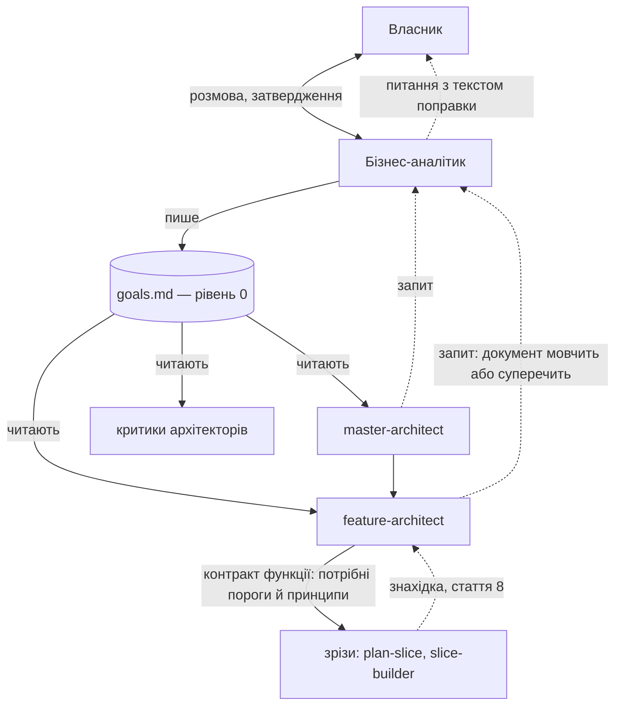

# 050 — Бізнес-аналітик і документ цілей: схвалений проєкт рішення

Це проєкт рішення, а не збудована річ: жодного файла двигуна не змінено, платних прогонів не
було. Власник відповів на вісім питань (`task.md` поруч); відповіді внесено в проєкт нижче.
Будує задача `tasks/todo/051-business-analyst-build.md`.

## Що змінилось для власника
- **У коді нічого.** Є схвалений проєкт і дві нові задачі на дошці: 051 (будівництво) і 052
  (документ цілей самого двигуна — з вами, наживо).
- **Суть.** Над архітектурою з'являється рівень 0 — один документ цілей проєкту
  (`.engine/goals.md`), який ви складаєте разом із бізнес-аналітиком і затверджуєте. Кожне
  рішення архітектора посилається на рядок цього документа; рішення без посилання вважається
  не звіреним, і це видно у вашому огляді. Сліпий критик перевіряє, чи посилання чесне.
- **Що змінили ваші відповіді проти чернетки:**
  - окрема роль (питання 1), і її метод береться з вашого документа знань
    `~/engine-ops/knowledge/business-analysis.md` — він уже є, тож навичка на нього не чекає;
  - жорстких меж розміру документа немає (питання 4): за стислістю стежить спрощувач, як за
    іншими інструкціями;
  - умови «прибрати аналітика, якщо не окупився» немає (питання 6): бізнес — джерело правди,
    аналітика лише покращують. Чотири сцени перевіряють якість його роботи, а не право ролі на
    існування; ваші виправлення стають уроками для його навички.
- **Бізнес-аналітик не вирішує нічого.** Він розпитує, загострює, знаходить суперечності й
  записує. Цілі, принципи й критерії «готово» — ваші (стаття 5 конституції). Конституція і
  `settings.json` не змінюються, нових hook-ів немає.

## Проєкт рішення

### 1. Роль, вхід і вихід

Бізнес-аналітик існує у двох формах з одного визначення.

| Форма | Коли | З ким говорить | Що видає |
|---|---|---|---|
| Команда `/business-analyst` | на початку проєкту, перед `/master-architect`; і коли ви самі хочете змінити цілі | з вами, наживо | `.engine/goals.md`, який ви затвердили |
| Агент `business-analyst` у свіжому контексті | після початкового планування, лише на запит архітектора (розділ 4) | з архітектором — через файл запиту | або дослівна цитата рядка документа, що вже відповідає; або сформульоване питання до вас із готовим текстом поправки |

З інженерами (зрізи: `plan-slice`, `slice-builder`, наглядач) він не говорить — це ваше рішення
в задачі.

**Вхід початкової розмови:** ваші слова, матеріали, які ви дасте (опис, листування, наявний
код), і для наявного проєкту — те, що вже записано в `.engine/architecture/` і `docs/adr/`.

**Звідки метод.** Обидві форми читають один довідник — `.claude/references/business-analysis.md`
(новий, читається на вимогу, у постійний контекст не входить). Він пишеться з вашого документа
знань, і лише із загальних методів; імен клієнтів, проєктів, сум і прикладів, за якими можна
впізнати чиюсь справу, у ньому бути не може — репозиторій публічний, і це перевіряє тест
(розділ 5). Документ знань я прочитав 2026-10-04 (138 рядків): приватних даних у ньому не
побачив, усі приклади загальні. Що з нього береться і куди:

| З документа знань | Куди в ролі |
|---|---|
| §1.1 справжня мета за проханням: крок назад від рішення до проблеми, «п'ять чому» | початкова розмова: кожна ціль проходить питання «яку проблему це розв'язує» до того, як її записано |
| §1.2 для кого цінність: користувач, власник процесу, ті, кому стане складніше | розділ документа «Для кого і навіщо» |
| §1.3, §3.1 цінність в об'єктивних одиницях; результат, а не виріб | форма рядка цілі: «видно з того, що …» |
| §2.1 п'ять питань на старті (що зламано; що буде, якщо нічого не робити; хто несе збитки; який обхідний шлях; як зрозуміємо на 30-й день) | кістяк початкової розмови, по одному питанню за раз |
| §2.2 коли аналітик зобов'язаний повернутися з питаннями | приводи для запиту (розділ 4) і те, що аналітик шукає у вашій відповіді |
| §3.2 принцип — справжній вибір між двома добрими речами | форма рядка принципу |
| §3.3 чого ми не робимо | розділ «Не-цілі» |
| §4 обмеження: закон, бюджет і ресурси, час (жорсткий строк проти бажаного) | розділ «Жорсткі обмеження» з джерелом кожного |
| §5 пастки: рішення замість проблеми, метрики для галочки, вигадані вимоги, золотий молоток | перелік, з яким аналітик перечитує чернетку документа перед вашим затвердженням |
| §6.2 сигнали тихого дрейфу вимоги («а ще було б добре…», виняток із правила, сутність змінила зміст) | привід 4 у розділі 4: аналітик називає дрейф зміною цілей, а не «дрібною правкою» |

Не береться: §3.4 (критерії готовності окремої задачі — це рівень зрізу, його тримають ворота і
наглядач; у документі цілей «готово» — лише на рівні всього проєкту) і §6.1 (черговість задач —
це дошка й архітектор, не аналітик).

**Як він веде розмову.** По одному питанню за раз, як M1 в архітектора. Чотири прийоми, заради
яких роль і існує:
1. *Ціль має бути спостережуваною.* «Зручний сервіс» не приймається; він питає «що ви побачите,
   коли це вдалося» і записує саме це.
2. *Принцип — це вибір між двома добрими речами.* «Ми цінуємо якість» відхиляється: ніхто не
   цінує протилежне. Приймається «швидкість виходу понад повноту функцій» — і до кожного
   принципу один приклад рішення, яке він розв'язує.
3. *Не-цілі обов'язкові й не порожні* — те, що напрошується, але свідомо не робиться, і чому.
4. *Суперечності шукає він, а не архітектор згодом.* Дві цілі, що тягнуть у різні боки без
   принципу, який каже, котра переважає, — це питання до вас ще в першій розмові.

Чого він **не** робить: не пропонує архітектуру, технології, поділ на функції; не вигадує
порогів і чисел; не затверджує документ сам. Без нагляду початкову розмову провести неможливо —
цілі не можна вивести з коду, тому це завжди задача з `Потрібна присутність власника: так`.

**Межа з архітектором.** Рядок «Product vision & constraints» з M1
(`.claude/commands/master-architect.md:81`) переїздить у документ цілей. Доменна модель,
обмежені контексти й технічні припущення лишаються в архітектора.

### 2. Формат документа цілей (`.engine/goals.md`)

Кожен рядок має постійний номер, щоб на нього можна було послатися.

```markdown
# Цілі проєкту <назва>
Версія: 3 · Затвердив власник: 2026-10-12

## Для кого і навіщо
Два-три речення: хто користувач, який його клопіт, що зміниться.

## Цілі
- G1. <що має статися> — видно з того, що <спостережувана ознака>.
- G2. …

## Принципи (що понад що)
- P1. <X> понад <Y>. Приклад: <рішення, яке цей принцип розв'язує>.
- P2. …

## Не-цілі
- N1. <чого свідомо не робимо> — бо <чому>.

## Жорсткі обмеження
- C1. <закон, строк, бюджет, масштаб> — джерело: <звідки це відомо>.

## Готово, коли
- D1. <перевірювана умова на рівні всього проєкту>.

## Відкрите
- Q1. <про що власник ще не вирішив> — до вирішення архітектори вважають: <тимчасове>.

## Зміни
- v3, 2026-10-12 — P2 переписано (запит 004 від feature-architect: кеш чи свіжість). Зачеплено: ADR 0007.
```

Правила формату:
- **Номери не перевикористовуються.** Скасований рядок лишається закресленим із датою —
  інакше старе посилання в ADR вкаже на інший зміст.
- **Жорсткої межі розміру немає** (ваша відповідь 4): проєкти різні. Документ стислий
  настільки, наскільки дозволяє проєкт. За розростанням стежить спрощувач: `.engine/goals.md`
  входить у те, на що дивиться його лінза `instructions` (вона вже є,
  `.claude/hooks/simplifier.py`), на тих самих сигналах, що й решта інструкцій. Спрощувач лише
  знаходить (повтор, рядок, на який ніхто не послався, ціль, що дублює іншу); викреслити рядок
  із документа цілей можете лише ви — знахідка про нього йде до вас питанням і ніколи не
  застосовується сама.
- **Документ запечатано** (відповідь 5). Після вашого затвердження його відбиток SHA-256
  записує скрипт у `.claude/state/` — так само, як уже запечатано контракт зрізу. Змінений
  після затвердження документ не чинний, доки ви не затвердите його знову; змінити його можна
  лише вашою відповіддю. Агент відбиток не чіпає.
- **У постійний контекст сесій документ не потрапляє.** Його не імпортує `CLAUDE.md` (межа
  200 рядків, `tests/test_context_budget.py`); архітектори й їхні критики читають його самі.
- Власник шляху — проєкт (`.claude/ownership.txt`, зразок у `templates/project/.engine/goals.md`);
  оновлення двигуна його ніколи не перезаписує.

**Чи документ обов'язковий** (відповідь 2): `/master-architect` у новому проєкті не починає
без затвердженого документа; `/feature-architect` у проєкті, де документа ще немає, попереджає
і працює як сьогодні; `/mvp-architect` його не вимагає, але читає, якщо він є.

### 3. Як архітектори звіряють рішення з документом



Зрізи документа не читають і бізнес-аналітика не кличуть: до інженерів цілі доходять лише
через контракт функції.

**Чотири точки звірки.**

1. **Архітектор — у кожній пропозиції.** У кожному ADR, у кожному розділі карти архітектури і в
   рамці кожної функції — короткий розділ «Звірка з цілями»:
   - *служить:* номери цілей і критеріїв «готово» (G…, D…);
   - *вибір між варіантами розв'язав:* номер принципу (P…) — або «принципи не розрізняють ці
     варіанти, вибір технічний»;
   - *не-цілі й обмеження:* які поруч і чому не зачеплено (N…, C…).

   Рішення без такого розділу або без жодного номера — **не звірене** (відповідь 6, пункт 2).
   Воно не блокується, але й не ховається: скрипт перелічує не звірені рішення, і огляд
   власника (`board.py review`) показує їх окремим розділом. Кожен критерій приймання функції
   посилається на G або D; критерій без опори — нове продуктове рішення, і воно йде до вас.

2. **Сліпий критик — нова лінза «відповідність цілям».** `master-critic`, `feature-critic` і
   `mvp-critic` отримують документ цілей у складі рамки продукту (поле `product_frame` у них
   уже є) і перевіряють чотири речі: посилання є і рядок справді каже те, що йому приписано;
   не-ціль не порушено; принцип не перевернуто (обрано Y там, де записано «X понад Y»); принцип
   не пропущено там, де варіанти різняться саме за ним. Це перевірка твору, а не міркувань
   автора (стаття 6): архітектор не може сам собі зарахувати відповідність.

3. **Скрипт — лише механіка.** `goals.py check`: розділ «Звірка з цілями» є, номери існують і не
   скасовані, документ збігається з відбитком; `goals.py unreconciled` — перелік не звірених
   рішень для огляду. Чи посилання *чесне*, скрипт не судить — це робота критика.

4. **Звіт функції** (відповідь 6, пункт 4). У звіті кожної збудованої функції — розділ «Які
   цілі вона просуває»: номери G і D з її рамки і одним рядком — чим саме. Функція, яка не
   просуває жодної цілі, так і записана.

**Зв'язок зі зрізами без порушення вашого правила.** Критик планування зрізу вже ескалює «обмін
двох непорівнянних благ без письмового ранжування» (`.claude/agents/slice-planner-critic.md`).
Принципи документа і є таким ранжуванням. Feature-architect переносить у контракт функції ті
принципи, що стосуються її зрізів, — і зріз має письмову відповідь, не читаючи рівня 0.

### 4. Коли бізнес-аналітика залучають після початкового планування

Лише архітектор і лише за одним із чотирьох приводів. Перелік закритий.

| № | Привід | Приклад |
|---|---|---|
| 1 | **Документ мовчить.** Варіанти різняться наслідком для користувача чи бізнесу, і жоден рядок не каже, котрий кращий | зберігати історію дій рік чи вічно |
| 2 | **Документ суперечить собі.** Дві цілі чи два принципи тягнуть у різні боки, а переваги не записано | G1 «відповідь миттєво» проти G3 «дані завжди найсвіжіші» |
| 3 | **Рішення зачепило б не-ціль, обмеження чи критерій «готово».** Зокрема, коли знизу прийшла знахідка (стаття 8), через яку ціль недосяжна в записаному вигляді, або коли більшість зусиль іде на випадок, якого цілі не називають | перевірка показала, що D2 неможливо виконати в межах C1 |
| 4 | **Цілі змінюються**: ви самі їх змінюєте, або архітектор бачить тихий дрейф — нове побажання, виняток із правила, сутність, що змінила зміст | нова ціль, знята не-ціль, «а ще було б добре…» |

**Не приводи:** технічний вибір без продуктового наслідку (архітектор вирішує сам); технічні
«двері в один бік» (ідуть прямо до вас, як сьогодні, — аналітик тут зайва ланка); питання зі
зрізу (спершу до feature-architect, і вже він вирішує, чи це привід 1–4).

**Як це відбувається.**
1. Архітектор пише запит `.engine/goals/requests/NNN.md`: яке рішення, які варіанти, що каже
   документ, чого бракує, чи це двері в один бік.
2. Запускає агента `business-analyst` у свіжому контексті з одним рядком — шляхом до запиту.
   Агент бачить запит, документ цілей і його журнал змін; розмови архітектора не бачить, тому
   не успадковує його схильності до одного з варіантів.
3. Агент відповідає одним із двох:
   - **«Документ уже відповідає»** — з дослівною цитатою рядка (відповідь 3: фільтр дозволено).
     Архітектор продовжує, вас не турбують. Цитату звіряє скрипт: рядка з таким номером і
     таким текстом немає в запечатаному документі — відповідь недійсна, і запит іде до вас.
     Тлумачити «в дусі документа» агентові заборонено. Усі такі відповіді видно в огляді.
   - **«Потрібне рішення власника»** — питання простою мовою, варіанти, найсильніший довід за
     кожен, порада і готовий текст поправки до документа.
4. Питання йде до вас: у розмові, якщо ви поруч; інакше — задачею в `tasks/blocked/`.
5. Поки ви не відповіли: двері у два боки — архітектор діє за порадою, позначає рішення
   `PROVISIONAL` і працює далі; двері в один бік — паркує цю гілку і бере іншу роботу. Це ті
   самі правила, що діють сьогодні.
6. Після вашої відповіді аналітик вносить поправку (нова версія, рядок у «Зміни»), скрипт
   оновлює відбиток за вашою відповіддю, а всі рішення, що посилалися на змінений рядок, скрипт
   знаходить за номером і позначає «переглянути» (відповідь 5) — це стаття 8, зроблена механічно.

### 5. Як зробити його корисним і як це перевіряти

Питання не «чи лишати аналітика», а «як зробити його кращим» (відповідь 6). Прибрати роль за
показниками не можна; жодне число нижче не є вироком.

**Безплатно, під час будівництва (тести двигуна):**
- `goals.py check` відмовляє на: відсутній розділ звірки, неіснуючий номер, скасований номер,
  документ, що розійшовся з відбитком, цитату, якої в документі немає; пропускає правильне
  (негативний випадок показано першим).
- Структурні тести визначень, як `tests/test_model_roles.py`: архітектори й три критики читають
  документ; `plan-slice`, `slice-builder`, `overseer` — **ні** (ваше правило стає тестом).
- Довідник методу не містить приватного: тест шукає в ньому прості ознаки — адреси пошти,
  телефони, посилання, суми з валютою. Імен клієнтів тест знати не може (їх перелік сам був би
  приватним), тож це нижня межа, а не гарантія; решту тримає правило «переказ методів, не
  копія» з розділу 7.
- Бюджет контексту не зріс (`tests/test_context_budget.py`).

**Платно, з вашого дозволу, ліміт 10 доларів — чотири сцени якості аналітика, кожна «до» і
«після»:**

| Сцена | Що подаємо | Якість добра, якщо |
|---|---|---|
| A. Порушена не-ціль | пропозиція архітектури, що тихо робить те, що записано в N | критик із документом вертає на доопрацювання й називає саме N; без документа — пропускає |
| B. Перевернутий принцип | два варіанти, обрано той, що суперечить P | критик називає саме P |
| C. Документ мовчить / технічне питання | два запити: продуктова прогалина і суто технічний вибір | архітектор ескалює перше і **не** ескалює друге |
| D. Документ уже відповідає | запит, на який є рядок у документі | аналітик вертає дослівну цитату саме цього рядка, питання до власника не виникає |

Сцена, що не пройшла, — це робота над визначенням аналітика чи лінзою критика, а не привід
відмовитися від ролі. Сцени лишаються в `evals/` і повторюються після кожної зміни його навички
(за окремим дозволом на платний прогін).

**Як він покращується в живій роботі** (відповідь 6, пункт 3). Кожне ваше виправлення, яке
аналітик мав передбачити, стає уроком: поправка до документа цілей, внесена не за запитом
архітектора, а за вашим зауваженням («цього в цілях не було, а мало бути»; «принцип записано
не так»), потрапляє в чергу уроків (`lesson_queue.py`, нове джерело `analyst`) з рядком, що
саме він не спитав. Далі — звичайний шлях уроку: ваш розбір, і лише за вашим «так» урок стає
рядком довідника методу. Сам агент свою навичку не переписує.

**Що видно у вашому огляді** (безплатно, з файлів): не звірені рішення; запити до аналітика і
котрі з них закрито цитатою; поправки до документа і що вони зачепили; уроки аналітика, що
чекають розбору. Це показники для читання, а не цілі для агента (стаття 3).

### 6. Ціна

Виміряних чисел для цієї ролі немає — нижче оцінки, і так їх і слід читати.
- Початкова розмова — одна розмова з вами, за розміром як нинішній M1; M1 від цього коротшає.
- Звірка в кожній пропозиції — документ цілей у контексті архітектора і критика; на тлі самих
  пропозицій це дрібниця.
- Запит до аналітика — один свіжий агент із малим входом. Найближче виміряне — аудит у свіжому
  контексті: $0.42–0.57 (`tasks/done/015-overseer-fresh-context/report.md`); запит має бути
  дешевшим, бо агент нічого не запускає.
- Чотири сцени «до» і «після» — вісім прогонів; ліміт, який ви дали, — 10 доларів.

### 7. Що змінюється (для задачі 051)

| Файл | Зміна |
|---|---|
| `.claude/commands/business-analyst.md` (новий) | початкова розмова і зміна цілей |
| `.claude/agents/business-analyst.md` (новий) | відповідь на запит архітектора; без інструментів правки коду |
| `.claude/references/business-analysis.md` (новий) | довідник методу з документа знань оператора — лише загальні методи |
| `.claude/hooks/goals.py` (новий) | `check`, `seal`, `affected <номер>`, `unreconciled`, перевірка цитати |
| `.claude/commands/master-architect.md`, `feature-architect.md`, `mvp-architect.md` | читати документ, розділ «Звірка з цілями», чотири приводи для запиту, «які цілі просуває» у звіті функції |
| `.claude/agents/master-critic.md`, `feature-critic.md`, `mvp-critic.md` | лінза «відповідність цілям» |
| `.claude/hooks/simplifier.py` / сигнали спрощувача | документ цілей — у полі зору лінзи `instructions`; знахідка про нього лише до власника |
| `.claude/hooks/lesson_queue.py` | джерело уроків `analyst` |
| `.claude/unattended/board.py` (огляд) | розділи: не звірені рішення, запити й цитати, поправки |
| `templates/project/.engine/goals.md`, `.claude/ownership.txt` | порожній зразок і власник шляху |
| `AGENTS.md`, `templates/project/AGENTS.md` | рівень 0 у переліку рівнів і шляхів (у межах 200 рядків) |
| `evals/` | чотири сцени якості |
| `tests/` | перелічене в розділі 5 |

Конституція і `settings.json` — без змін.

**Застереження про приватне.** Документ знань лежить поза репозиторієм
(`~/engine-ops/knowledge/`), і так має лишитися: у двигун потрапляє переказ методів, не копія
файла. Якщо ви згодом допишете туди приклади з живих справ, будівельник бере метод і лишає
приклад; сумнівне — питанням до вас, не в репозиторій.

## Що я розглянув і відкинув
- **Аналітик говорить з усіма рівнями.** Відкинуто вашим рішенням у задачі; до того ж це знову
  зробило б продуктові питання дрібними й частими.
- **Документ цілей у постійному контексті кожної сесії** (імпорт у `CLAUDE.md`). Дешево, але
  тоді його читають і інженери, а межа 200 рядків зайнята.
- **Аналітик сам оновлює документ, коли архітектор знайшов прогалину.** Порушує статтю 5.
- **Жодної окремої ролі — лише розширити M1 в архітектора.** Відкинуто вашою відповіддю 1.
- **Числові межі розміру документа** і **умова «прибрати роль»** — були в чернетці, відкинуто
  вашими відповідями 4 і 6.
- **Копіювати документ знань у репозиторій як є.** Простіше, але файл оператора живе своїм
  життям і може отримати приватні приклади; двигун публічний.

## Демонстрація на хвилину
Показувати нічого: це проєкт. Щоб оцінити його за хвилину, прочитайте зразок документа в
розділі 2 і таблицю приводів у розділі 4 — у них уся суть. Далі: `ls tasks/todo/` покаже 051 і
052; `python3 .claude/unattended/board.py next` — що дошка візьме наступним.

## Витрати
Дві сесії агента (чернетка з питаннями; закриття з відповідями), без платних прогонів, без
підагентів. Тести не запускались — жодного `.py` чи `.sh` не змінено.

## Діапазон commit-ів
`a4b70cd` (чернетка і вісім питань у `blocked/`) … commit закриття дошки
«board: 050-business-analyst-design → done».

## Відкладене
- Будівництво — задача 051 у `todo/`.
- Документ цілей самого двигуна — задача 052 у `todo/`, лише з вами в розмові (відповідь 7).
- Як режими (задача 080) вмикають чи полегшують цю роль — вирішується в 080.
- У задачі 080 записано `Залежить від: … 050 …`, а не 051. Чужу задачу я не правив. За номером
  051 і так іде раніше; але якщо 051 застрягне в `blocked/`, 080 почнеться без збудованого
  аналітика. Якщо це небажано — допишіть 051 у залежності 080.
- Задачі 060 і 070 від 052 не залежать: якщо хочете, щоб вони вже звірялися з документом цілей
  двигуна, спершу проведіть 052.

## Рішення, які я ухвалив сам
- Документ лежить у `.engine/goals.md`: це запис проєкту, а не налаштування воріт.
- Жорсткі обмеження (строк, бюджет, закон) — окремий розділ документа, хоча в задачі їх не
  названо: без них принципи нема з чим звіряти, і ваш документ знань (§4) каже те саме.
- Метод аналітика — окремий довідник у `.claude/references/`, який читають і команда, і агент,
  а не текст, вписаний у кожне з двох визначень: одне місце для уроків і для перевірки на
  приватне.
- З документа знань не беру §3.4 і §6.1 (рівень задачі й черговість) — це не робота аналітика
  в цьому проєкті рішення.
- Не звірене рішення не блокується, лише показується в огляді: ви просили, щоб його було
  видно; блокування зробило б із посилання формальність, яку вписують, аби пройти.
- Знахідка спрощувача про документ цілей ніколи не застосовується сама — лише питанням до вас
  (стаття 5).
- Уроки аналітика йдуть наявною чергою уроків з новим джерелом, а не окремим механізмом.
- Привід 4 розширено тихим дрейфом вимог, привід 3 — невідповідністю зусиль і цінності: обидва
  з вашого документа знань (§2.2, §6.2), обидва лишаються приводами архітектора.
- Технічні «двері в один бік» ідуть до власника повз аналітика, як сьогодні.
- Запити архітекторів зберігаються файлами в `.engine/goals/requests/`.
- Задача будівництва має номер 051, жива проба — 052 і залежить від 051: перші вільні номери
  після 050, тож дошка візьме 051 перед 060 без окремої логіки черговості (відповідь 8).
- Платні сцени записано в 051 рядком `Платні прогони: … ліміт 10 доларів` — ваш дозвіл із
  відповіді 6, перенесений у задачу, яка їх запускатиме.
